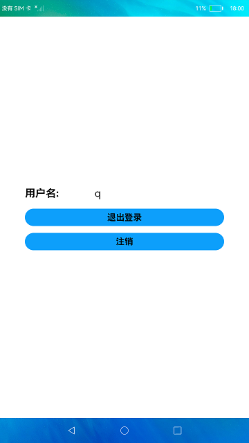

# 分布式账号管理

### 简介

本示例主要演示了分布式账号的登录、退出登录、注销等操作。实际效果如下：

### 相关概念

该模块实现了分布式账号的登录、退出和注销的功能。

### 相关权限

账号管理权限：ohos.permission.MANAGE_LOCAL_ACCOUNTS

### 使用说明

1. 输入**用户名**和**密码**，点击**登录**按钮。如果登录成功，则会跳转到用户页面，并显示登录时的用户名。如果登录不成功，则弹框提示登录失败。

2. 在用户页面中，点击**退出登录**按钮，如果退出成功则返回登录页面。如果失败，则弹框提示退出登录失败。

3. 点击**注销**按钮，如果注销成功则返回登录页面。如果失败，则弹框提示注销失败。

### 约束与限制

1.本示例仅支持在标准系统上运行。

2.本示例需要使用DevEco Studio 3.0 Beta4 (Build Version: 3.0.0.992, built on July 14, 2022)才可编译运行。

3.本示例所配置的权限ohos.permission.MANAGE_LOCAL_ACCOUNTS为system_basic级别(相关权限级别可通过[权限定义列表](https://gitee.com/openharmony/docs/blob/master/zh-cn/application-dev/security/permission-list.md)查看)，需要手动配置对应级别的权限签名(具体操作可查看[自动化签名方案](https://docs.openharmony.cn/pages/v3.2Beta/zh-cn/application-dev/security/hapsigntool-overview.md/))。

