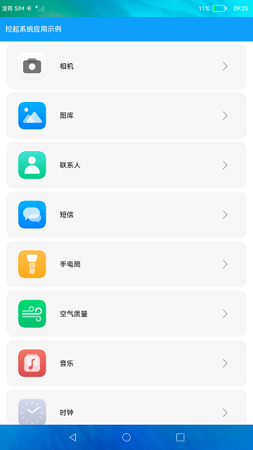

# 拉起系统应用示例

### 介绍

本示例选择想要拉起的应用，点击相应图标拉起应用。

本示例使用[LazyForeach](https://gitee.com/openharmony/docs/blob/master/zh-cn/application-dev/ui/ts-rending-control-syntax-lazyforeach.md)从提供的数据源中按需迭代数据，并在每次迭代过程中创建相应的组件。

本示例使用[FeatureAbility模块](https://gitee.com/openharmony/docs/blob/master/zh-cn/application-dev/reference/apis/js-apis-featureAbility.md)，通过应用的bundleName名与Ability名，拉起系统应用。

使用说明：

选择想要拉起的应用，点击相应图标拉起应用。

### 效果预览

### 相关权限

允许应用查询其他应用的信息：[ohos.permission.GET_BUNDLE_INFO_PRIVILEGED](https://gitee.com/openharmony/docs/blob/master/zh-cn/application-dev/security/permission-list.md)

### 相关依赖

不涉及。

### 约束与限制

1.本示例仅支持标准系统上运行，支持设备：支持RK3568。

2.本示例仅支持API8版本SDK，版本号：3.1.7.5。

3.本示例需要使用DevEco Studio 3.0 Beta4 (Build Version: 3.0.0.992, built on July 14, 2022)才可编译运行。

4.本示例使用的innerBundleManager为系统接口，需要使用Full SDK手动从镜像站点获取，并在DevEco Studio中替换，具体操作可参考[替换指南](https://gitee.com/openharmony/docs/blob/master/zh-cn/application-dev/quick-start/full-sdk-switch-guide.md)。

5.本示例所配置的权限ohos.permission.GET_BUNDLE_INFO_PRIVILEGED为system_basic级别(相关权限级别可通过[权限定义列表](https://gitee.com/openharmony/docs/blob/master/zh-cn/application-dev/security/permission-list.md)查看)，需要手动配置对应级别的权限签名(具体操作可查看[自动化签名方案](https://docs.openharmony.cn/pages/v3.2Beta/zh-cn/application-dev/security/hapsigntool-overview.md/))。

