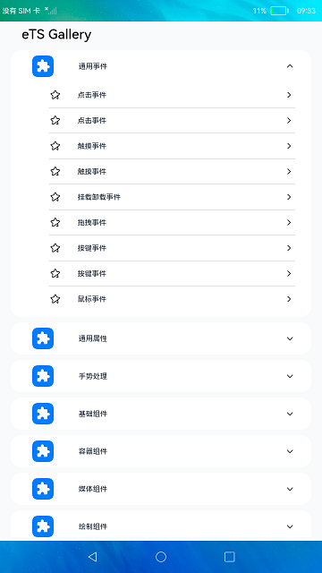
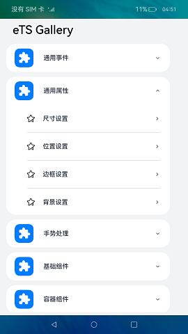
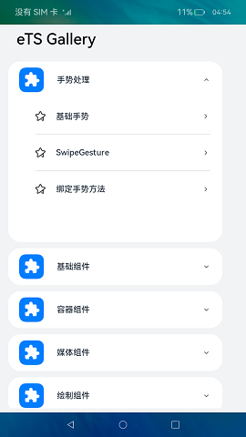
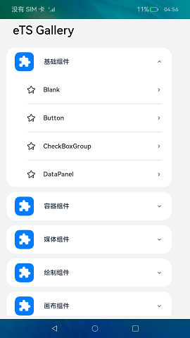
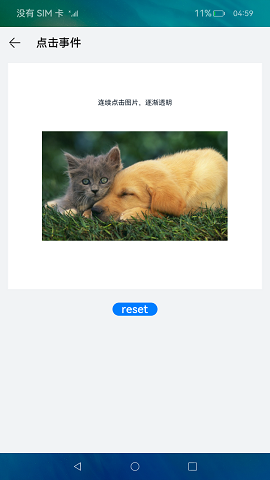
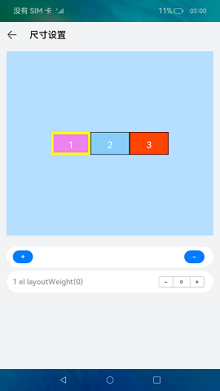
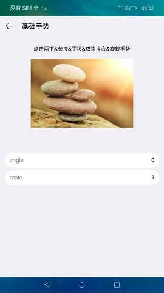
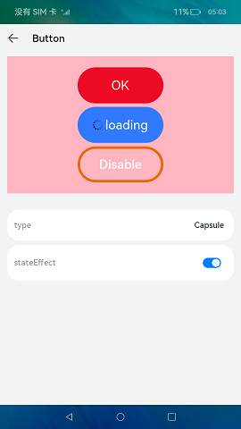

# 组件集合

### 简介

本示例向用户介绍通用事件、通用属性、手势处理等不同组件的功能。效果图如下：

|通用事件|通用属性|手势处理|基础组件|
|--------------------------------|--------------------------------|--------------------------------|--------------------------------|
|||||
|
点击事件
|
尺寸属性
|
基础手势
|
Button
|
|||||

### 相关概念

组件：通用事件、通用属性、手势处理等。

### 相关权限

不涉及。

### 使用说明

1.主页面选择组件菜单，在菜单中选择组件示例。

2.按照示例提示体验组件功能。

3.点击返回图片，返回主页面。

### 约束与限制

1.本示例仅支持在标准系统上运行。

2.本示例需要使用DevEco Studio 3.0 Beta4 (Build Version: 3.0.0.992, built on July 14, 2022)才可编译运行。