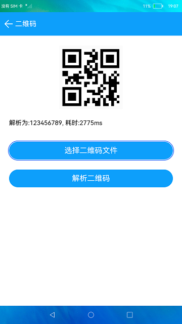

# 二维码

### 简介

本示例展示了在eTS中如何生成二维码和如何使用jsqr解析二维码。

在工程中使用npm安装jsqr，安装步骤：

1.在**DevEco Studio**的控制台Terminal窗口中，执行cd entry进入entry目录。

2.执行npm install jsqr --save 命令安装jsqr。

3.在工程中import jsQR from 'jsqr'导入后即可使用。

实现效果如下：

 

### 相关概念

QRCode：显示二维码信息组件，传入要生成二维码的字符串即可显示生成的二维码。
jsqr：提供解析二维码的api，支持npm安装。

### 相关权限

获取屏幕截图权限：ohos.permission.CAPTURE_SCREEN

### 使用说明

1.启动应用,点击**生成二维码**进入界面，在输入框中输入内容，下方显示输入内容生成的二维码。

2.点击**保存二维码**可以将当前二维码图片保存到本地。

3.点击**解析二维码**进入界面，会显示一个默认的二维码，点击**选择二维码文件**可以在设备中选择生成二维码界面中保存的二维码图片。

4.点击**解析二维码**，解析完成会在二维码下方显示解析结果。

### 约束与限制

1.本示例仅支持标准系统上运行。

2.本示例为Stage模型，从API version 9开始支持。

3.本示例需要使用DevEco Studio 3.0 Beta4 (Build Version: 3.0.0.992, built on July 14, 2022)才可编译运行。

4.本示例需要使用@ohos.screenshot系统权限的系统接口。使用Full SDK时需要手动从镜像站点获取，并在DevEco Studio中替换，具体操作可参考[替换指南](https://gitee.com/openharmony/docs/blob/master/zh-cn/application-dev/quick-start/full-sdk-switch-guide.md)。

5.本示例所配置的权限ohos.permission.CAPTURE_SCREEN为system_core级别(相关权限级别可通过[权限定义列表](https://gitee.com/openharmony/docs/blob/master/zh-cn/application-dev/security/permission-list.md)查看)，需要手动配置对应级别的权限签名(具体操作可查看[自动化签名方案](https://docs.openharmony.cn/pages/v3.2Beta/zh-cn/application-dev/security/hapsigntool-overview.md/))。

