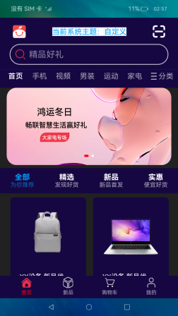

# 主题切换应用示例

## 介绍

本示例展示多种主题切换场景。

本示例通过创建base同级资源文件夹dark实现深色主题相关资源配置。使用onConfigurationUpdated监听系统深浅模式切换，配置自定义主题。

使用说明：

1. 点击头部切换主题按钮，选择想要切换的主题。
2. 系统深浅模式切换，应用主题跟随切换深浅模式。

## 效果预览

## 相关权限

允许更新系统配置：[ohos.permission.UPDATE_CONFIGURATION](https://gitee.com/openharmony/docs/blob/master/zh-cn/application-dev/security/permission-list.md)

## 约束与限制

1. 本示例仅支持标准系统上运行，支持设备：RK3568。
2. 本示例支持API9版本SDK，版本号：3.2.6.5。
3. 本示例需要使用DevEco Studio 3.0 Beta4 (Build Version: 3.0.0.993, built on July 14, 2022)才可编译运行。
