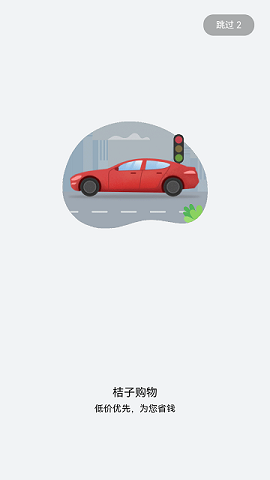

# 转场动画

### 介绍

本示例展示了转场动画的使用，包括进场动画、页面间转场、组件内转场和共享元素转场。

### 效果预览

|开场动画|转场动画|
|----|----|
|||

使用说明
1. 点击**进场动画**，进入进场动画，当进场动画结束或跳过进场动画时返回首页。
2. 点击**页面间转场：底部滑入**，进入新的页面，页面转场动画为从底部滑入，退出页面时向底部滑出。
3. 点击**页面间转场：自定义1**，进入新的页面，入场时透明度从0.2到1，x、y轴缩放从0变化到1，页面退出时，x轴的偏移量为500，x,y轴缩放从1变化到0。
4. 点击**页面间转场：自定义2**，进入新的页面，入场时旋转并从0放大到1，透明度从0到1，页面退出时，旋转并从1缩小到0，透明度从1到0。
5. 点击**组件内转场**，进入新的页面，点击**显示**，出现组件出场动画，动画完成组件显示，点击**隐藏**，组件会隐藏，并显示隐藏动画。
6. 点击**共享元素转场**，进入新的页面，点击界面的图片会到大图页面，页面出场和退场有共享元素转场动画。

### 工程目录
```
animation/src/main/ets/components/
|---MainPage
|   |---MainPage.ets                                    // 广告页面
|   |---Show.ets                                        // 入场过渡页面
entry/src/main/ets/
|---common
|   |---TitleBar.ets                                    // 顶部导航栏
|---model
|   |---Logger.ts                                       // 日志工具
|---pages
|   |---page
|   |   |---BottomTransition.ets                        // 底部入场动画
|   |   |---CustomTransition.ets                        // 透明度入场动画
|   |   |---CustomTransition2.ets                       // 位移入场动画
|   |---share
|   |   |---ShareItem.ets                               // 共享元素转场项
|   |   |---SharePage.ets                               // 共享元素转场页面
|   |---ComponentTransition.ets
|   |---Home.ets                                        // 过渡页面
|   |---Index.ets                                       // 首页
```
### 具体实现
+ 本实例使用[页面转场](https://gitee.com/openharmony/docs/blob/master/zh-cn/application-dev/reference/arkui-ts/ts-page-transition-animation.md)在全局pageTransition方法内配置页面入场组件和页面退场组件来自定义页面转场动效。[组件转场](https://gitee.com/openharmony/docs/blob/master/zh-cn/application-dev/reference/arkui-ts/ts-transition-animation-component.md)主要通过transition属性配置转场参数，在组件插入和删除时进行过渡动效，主要用于容器组件、子组件插入删除时提升用户体验。在组件中通过sharedTransition方法设置[共享元素转场](https://gitee.com/openharmony/docs/blob/master/zh-cn/application-dev/reference/arkui-ts/ts-transition-animation-shared-elements.md)，两个页面的组件配置为同一个id，则转场过程中会进行共享元素转场，配置为空字符串时不会有共享元素转场效果。

### 相关权限

不涉及。

### 依赖

不涉及。

### 约束与限制

1. 本示例仅支持标准系统上运行，支持设备：RK3568。
2. 本示例仅支持API9版本SDK，版本号：3.2.10.6。
3. 本示例需要使用DevEco Studio 3.1 Canary1 (Build Version: 3.1.0.100)及以上才可编译运行。

### 下载
如需单独下载本工程，执行如下命令：
```
git init
git config core.sparsecheckout true
echo ETSUI/TransitionAnimation/ > .git/info/sparse-checkout
git remote add origin https://gitee.com/openharmony/applications_app_samples.git
git pull origin master
```