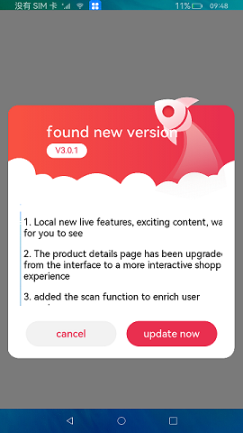

# Custom Dialog Box

### Introduction

This sample demonstrates a custom dialog box used in upgrade scenarios.

In this sample, the [**\<CustomDialogController>**](https://gitee.com/openharmony/docs/blob/master/en/application-dev/reference/arkui-ts/ts-methods-custom-dialog-box.md) component is used to implement the custom dialog box, which provides upgrade information for users; the [**\<RichText>**](https://gitee.com/openharmony/docs/blob/master/zh-cn/application-dev/reference/arkui-ts/ts-basic-components-richtext.md) component is used to display the upgrade information.

### Usage

1. When you start the sample app, an upgrade dialog box is displayed.

2. You can touch **Cancel** or **Upgrade Now**. The dialog box will be closed.

### Display Effect

### Required Permissions

[ohos.permission.INTERNET](https://gitee.com/openharmony/docs/blob/master/en/application-dev/security/permission-list.md), which allows an app to use network sockets.

### Dependency

N/A

### Constraints

1. This sample can only be run on standard-system devices that use the Rockchip RK3568 chip.

2. This sample is based on the stage model, which is supported from API version 9 (SDK version: 3.2.5.5). 

3. DevEco Studio 3.0 Beta4 (Build version: 3.0.0.992, built on July 14, 2022) must be used.
