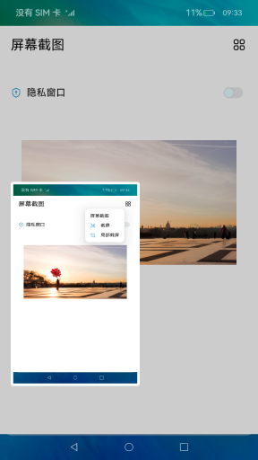
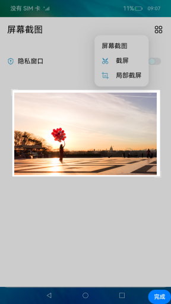
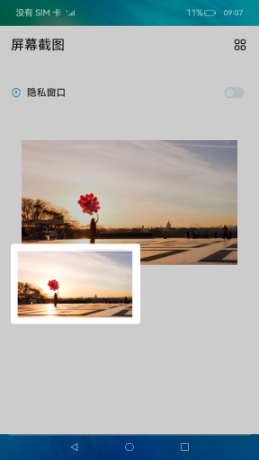

# 截屏

## 介绍

本示例展示全屏截图和屏幕局部截图。

本示例通过[screenshot](https://gitee.com/openharmony/docs/blob/master/zh-cn/application-dev/reference/apis/js-apis-screenshot.md)模块实现屏幕截图 ，通过[window](https://gitee.com/openharmony/docs/blob/master/zh-cn/application-dev/reference/apis/js-apis-window.md#setwindowprivacymode9)模块实现隐私窗口切换，通过[display](https://gitee.com/openharmony/docs/blob/master/zh-cn/application-dev/reference/apis/js-apis-display.md#displayhasprivatewindow9)模块查询当前隐私窗口。

使用说明：

1. 点击右上角图标打开弹窗，选择截屏，展示全屏截图；选择局部截屏，选择截屏区域，点击右下角完成，展示局部截屏；
2. 点击滑块切换窗口隐私模式，隐私模式下截屏会弹出提示，拒绝截屏。

## 效果预览

## 相关权限

获取屏幕截图权限：[ohos.permission.CAPTURE_SCREEN](https://gitee.com/openharmony/docs/blob/master/zh-cn/application-dev/security/permission-list.md)

## 约束与限制

1. 本示例仅支持标准系统上运行，支持设备：RK3568；
2. 本示例支持 API9 版本 SDK，本示例涉及使用系统接口：@ohos.screenshot，需要手动替换 Full SDK
   才能编译通过，具体操作可以参考[替换指南](https://gitee.com/openharmony/docs/blob/master/zh-cn/application-dev/quick-start/full-sdk-switch-guide.md)
   ；
3. 本示例需要使用 DevEco Studio 3.0 Release (Build Version: 3.0.0.993, built on September 06, 2022)才可编译运行。
4. 本示例所配置的权限 ohos.permission.CAPTURE_SCREEN 为 system_core 级别(
   相关权限级别可通过[权限定义列表](https://gitee.com/openharmony/docs/blob/master/zh-cn/application-dev/security/permission-list.md)查看)，需要手动配置对应级别的权限签名(具体操作可查看[自动化签名方案](https://docs.openharmony.cn/pages/v3.2Beta/zh-cn/application-dev/security/hapsigntool-overview.md/))；
5. 本示例需要设置为系统应用才可使用接口 hasPrivacyWindow 判断隐私窗口,签名文件中修改 app-feature 为 hos_system_app。
