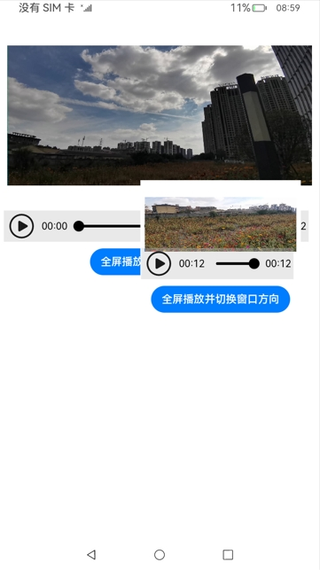

# 窗口

### 介绍

本示例展示了在应用主窗口中创建和拉起子窗口，并对子窗口设置窗口相关属性，以及设置窗口规避区域、窗口沉浸式和小窗口等功能。
 
 
 本实例使用[窗口管理](https://gitee.com/openharmony/docs/blob/master/zh-cn/application-dev/reference/apis/js-apis-window.md)
 
 
1.启动应用,首页展示窗口沉浸式以及设置状态栏和任务栏属性,点击窗口视频跳转到播放页。

2.点击视频屏幕可以拉起小窗口播放和改变小窗口亮度以及设置窗口隐私模式和相关窗口属性并进行触摸移动,点击小窗口区域外可以关闭小窗口。

3.点击全屏播放并切换窗口方向按钮可以全屏播放视频并且改变窗口方向。

### 效果预览

- 
  

### 相关权限

本示例需要在module.json5中配置如下权限:

允许应用使用悬浮窗的能力：[ohos.permission.SYSTEM_FLOAT_WINDOW](https://gitee.com/openharmony/docs/blob/master/zh-cn/application-dev/security/permission-list.md)

### 依赖

不涉及。

### 约束与限制

1.本示例仅支持标准系统上运行,支持设备:RK3568。

2.本示例仅支持API9版本SDK，版本号：3.2.5.6。

3.本示例需要使用DevEco Studio 3.0 Beta4 (Build Version: 3.0.0.993, built on July 14, 2022)才可编译运行。