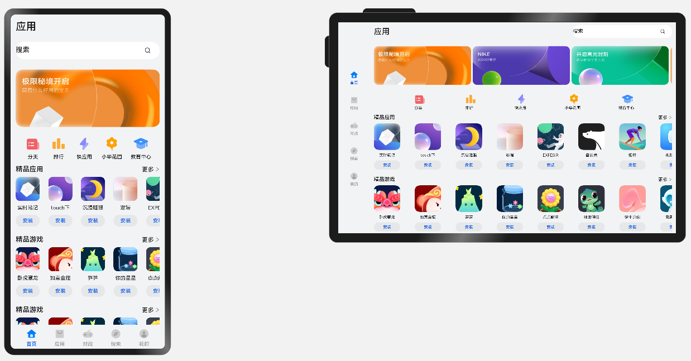
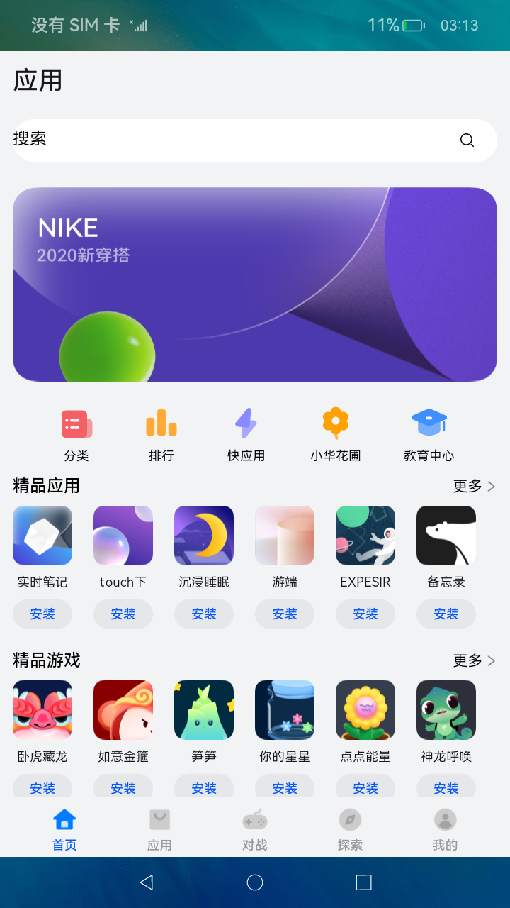
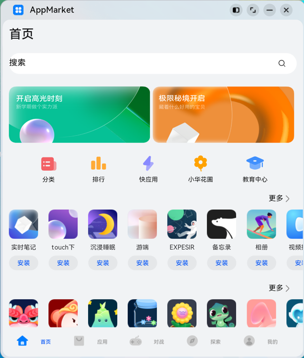

# 一多典型页面场景：应用市场首页

### 介绍
本示例是[《一次开发，多端部署》](https://gitee.com/openharmony/docs/tree/master/zh-cn/application-dev/key-features/multi-device-app-dev)的配套示例代码，以“应用市场首页”为例，展示了一多页面开发的核心流程：

- 借助[自适应布局能力](https://gitee.com/openharmony/docs/blob/master/zh-cn/application-dev/key-features/multi-device-app-dev/adaptive-layout.md)，实现页面中各区域的基础显示效果。保证页面尺寸在一定范围内变化时，其内容自适应调整及合理显示。
- 借助[响应式布局能力](https://gitee.com/openharmony/docs/blob/master/zh-cn/application-dev/key-features/multi-device-app-dev/responsive-layout.md)，调整不同断点下页面中各区域间的相对位置或区域内的显示效果。保证页面尺寸在较大范围内变化时，其内容始终合理显示。

建议将本示例与《一次开发，多端部署》中的[“应用市场首页”章节](https://gitee.com/openharmony/docs/blob/master/zh-cn/application-dev/key-features/multi-device-app-dev/appgallery-home-page.md)搭配阅读及理解。

本示例中的应用市场首页包含Tab栏、运营横幅、精品应用、精品游戏等。开发者可以分别查看页面中各区域的实现以及各区域如何组合为完整的页面，了解一多页面开发的流程。

### 效果预览

本示例在预览器中的效果：

本示例在开发板上运行的效果：

| 全屏显示                         | 窗口操作按钮                      | 悬浮窗口显示                      |
| -------------------------------- | --------------------------------- | --------------------------------- |
|  |  |  |

使用说明：

1. 启动应用，可以查看本应用在全屏状态下的显示效果。

2. 在应用顶部，下滑出现窗口操作按钮。（建议通过外接鼠标操作，接入鼠标只需要将鼠标移动至顶部即可出现窗口）

3. 点击悬浮图标，将应用悬浮在其它界面上显示。

4. 拖动应用悬浮窗口的边框，改变窗口尺寸，触发应用刷新，即可查看应用在不同窗口下的显示效果。

   改变窗口尺寸的过程中，窗口尺寸可能超出屏幕尺寸。此时在屏幕中只能看到应用部分区域的显示，但可以通过移动窗口位置，查看应用其它区域的显示。

### 相关权限

不涉及。

### 依赖

不涉及

### 约束与限制
1. 本示例仅支持在标准系统上运行。

2. 本示例仅支持API9版本的SDK，版本号： 3.2.5.5 Beta2。

3. 本示例需要使用DevEco Studio 3.0 Beta4 (Build Version: 3.0.0.992, built on July 14, 2022)才可编译运行。

4. 本示例在开发板上运行时，可以[修改开发板系统配置文件以开启自由窗口能力](https://gitee.com/openharmony/docs/blob/master/zh-cn/application-dev/key-features/multi-device-app-dev/faq.md#%E5%A6%82%E4%BD%95%E5%BC%80%E5%90%AF%E8%87%AA%E7%94%B1%E7%AA%97%E5%8F%A3)。

