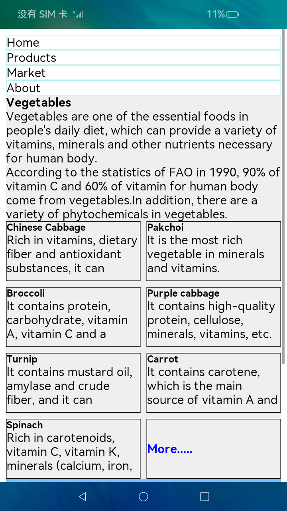
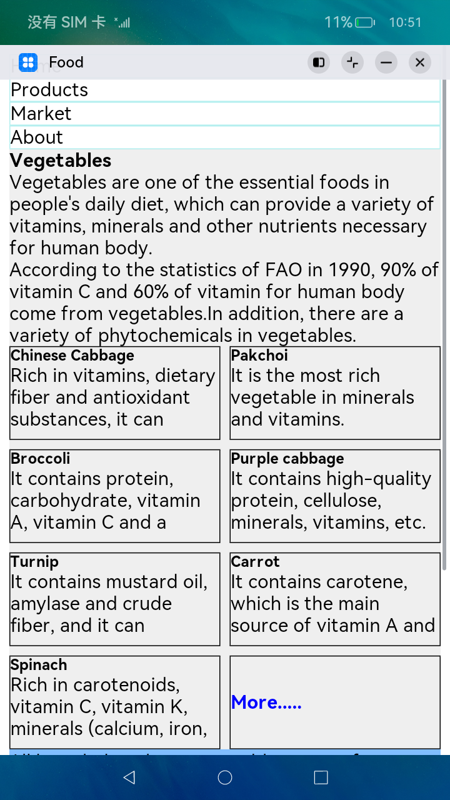
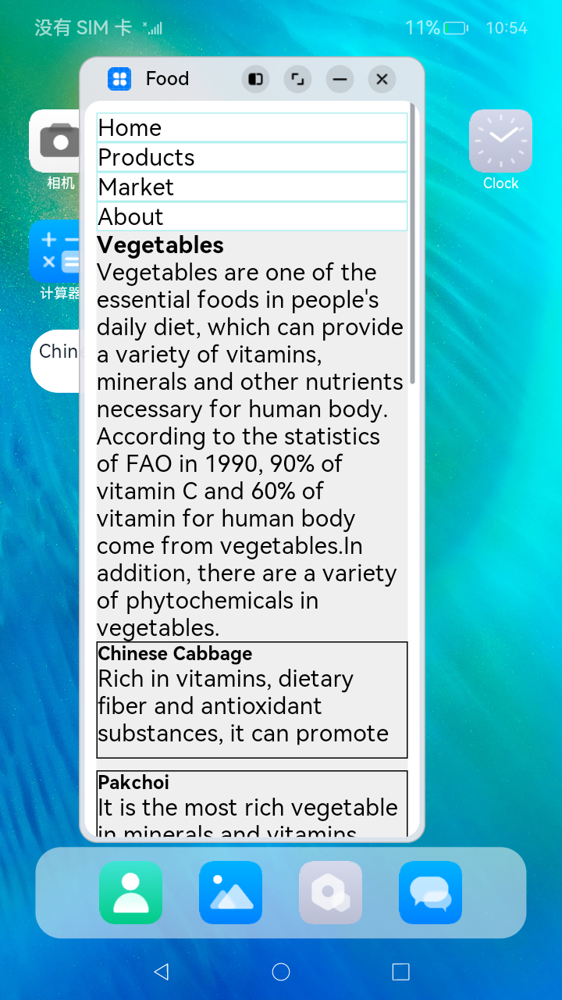

# 一多蔬菜百科主页

### 介绍

本示例展示了蔬菜百科页面在不同窗口尺寸下的布局自适应能力，主要包含3个部分。

- 首页：分为五个区域，分别是菜单栏、内容卡片显示、相关信息、外部链接和联系我们，每个区域通过自定义组件实现。整体布局使用栅格组件，每个区域在不同断点下占用不同的栅格数，保证自适应效果。其中，菜单栏使用栅格组件控制子项的占比，内容卡片显示中的卡片内容也是使用栅格组件控制子卡片内容的占比，其他三个区域较为简单使用了常规的Row/Column布局组件。
- 更多：显示更多的卡片内容信息。主要使用Grid组件，并且结合断点动态更改Grid组件的属性columnsTemplate，从而控制Grid组件在不同窗口尺寸下的显示列数。
- 桌面卡片：显示蔬菜名字以及推荐星级。通过首选项Preferences存储存放蔬菜信息数组的索引，并通过卡片生命周期回调onUpdate通过获取Preferences存储的索引更新桌面卡片上的内容。

本示例使用[一次开发多端部署](https://gitee.com/openharmony/docs/tree/master/zh-cn/application-dev/key-features/multi-device-app-dev)中介绍的自适应布局能力和响应式布局能力进行多设备（或多窗口尺寸）适配，特别是较多使用了栅格组件和断点能力，保证应用在不同设备或不同窗口尺寸下可以正常显示。

使用说明：

1.启动应用，查看本应用在全屏状态下的效果。

2.在应用顶部，下滑出现窗口操作按钮。（建议通过外接鼠标操作，接入鼠标只需要将鼠标移动至顶部即可出现窗口）

3.点击悬浮图标，将应用悬浮在其他界面上显示。

4.拖动应用悬浮窗口的四个顶角，改变窗口尺寸，触发应用显示刷新。改变窗口尺寸的过程中，窗口尺寸可能超出屏幕尺寸，此时在屏幕中只能看到应用部分区域的显示。可以通过移动窗口位置，查看应用其它区域的显示。

### 效果预览

本示例首页在预览器中的效果：


本示例首页在开发板上运行的效果：

| 全屏显示                          | 窗口操作按钮                      | 悬浮窗口显示                      |
| --------------------------------- | --------------------------------- | --------------------------------- |
|  |  |  |

### 相关权限

不涉及。

### 依赖

不涉及。


### 约束与限制

1. 本示例仅支持在标准系统上运行。
2. 本示例仅支持API9版本的SDK，版本号： 3.2.5.5 Beta2。
3. 本示例需要使用DevEco Studio 3.0 Beta4 (Build Version: 3.0.0.992, built on July 14, 2022)才可编译运行。
4. 本示例在开发板上运行时，需要修改开发板系统配置文件以使能应用窗口能力。

```shell
# 将开发板文件系统的权限配置为可读写
hdc shell mount -o rw,remount /
# 取出原始配置文件
hdc file recv system/etc/window/resources/window_manager_config.xml C:\
# 将文件中<decor enable="false"></decor>改为<decor enable="true"></decor>
# 用修改后的文件替换系统中的原始文件
hdc file send C:\window_manager_config.xml system/etc/window/resources/window_manager_config.xml
# 重启后生效
hdc shell reboot
```

