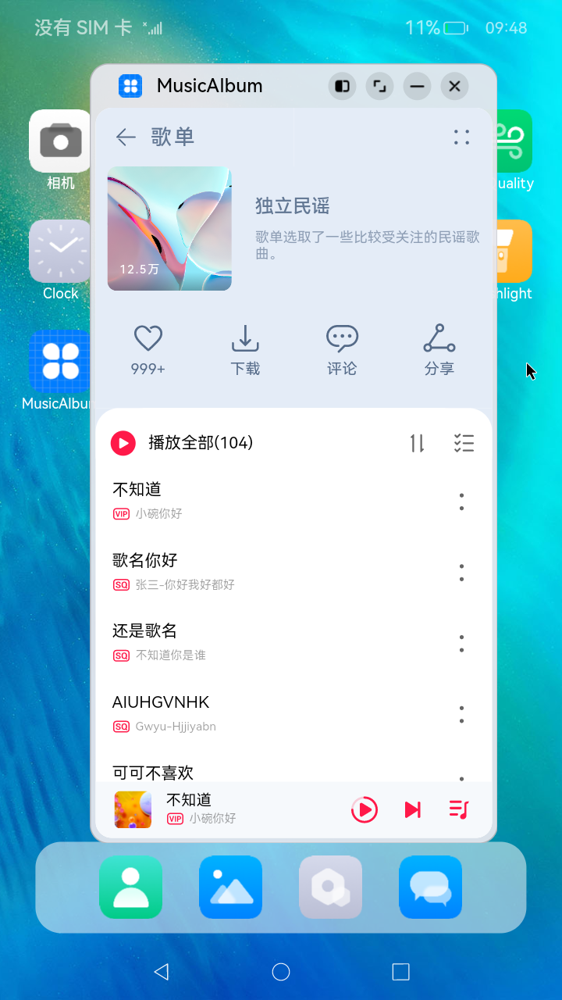
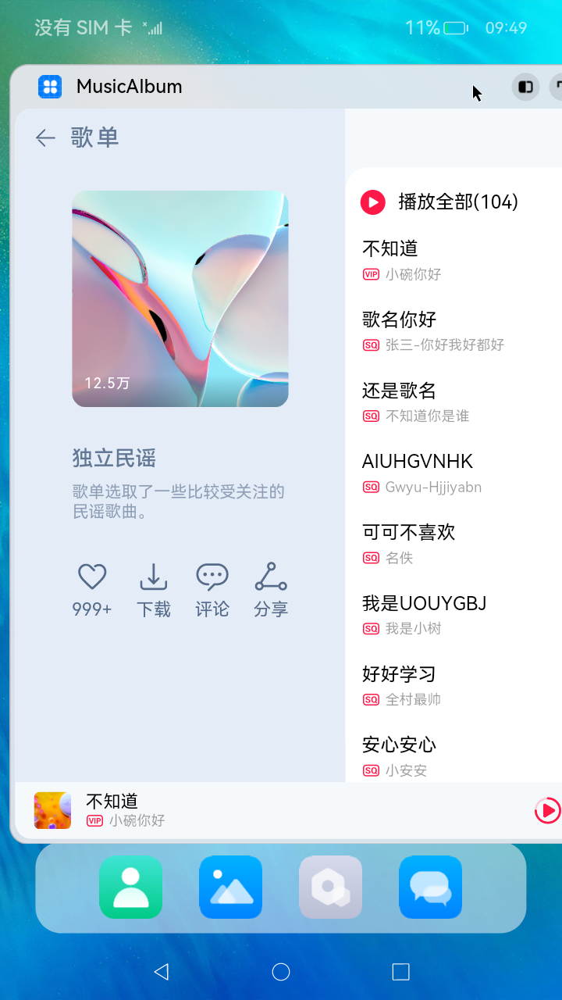

## 一多适配能力

#### 简介

本示例展示了新栅格组件如何使用自适应布局能力和响应式布局能力进行多设备（或多窗口尺寸）适配，保证应用在不同设备或不同窗口尺寸下可以正常展示。

#### 相关概念

一次开发多端部署：一套代码工程，一次开发上架，多端按需部署。

自适应布局：当外部容器大小发生变化时，元素可以根据相对关系自动变化以适应外部容器变化的布局能力。

响应式布局：当外部容器大小发生变化时，元素可以根据断点、栅格或特定的特征（如屏幕的方向、窗口宽高等）自动变化以适应外部环境变化的的布局能力。

#### 相关权限

不涉及。

#### 使用说明

1.启动应用，查看本应用在全屏状态下的效果。

2.在应用顶部，下滑出现窗口操作按钮。（建议通过外接鼠标操作，接入鼠标只需要将鼠标移动至顶部即可出现窗口）

3.点击悬浮图标，将应用悬浮在其他界面上显示。

4.拖动应用悬浮窗口的四个顶角，改变窗口尺寸，触发应用显示刷新。改变窗口尺寸的过程中，窗口尺寸可能超出屏幕尺寸，此时在屏幕中只能看到应用部分区域的显示。可以通过移动窗口位置，查看应用其它区域的显示。

5.点击关闭按钮，关闭应用。

#### 约束与限制

1.本实例仅支持在标准系统上运行。

2.本实例为Stage模型，从API version9开始支持。

3.本示例需要使用DevEco Studio 3.0 Beta4 (Build Version: 3.0.0.991, built on July 6, 2022)才可编译运行。

4.本实例在RK板上运行需要修改RK文件才能使用应用窗口能力，操作如下：

+ 使用hdc file recv system/etc/window/resources/window_manager_config.xml C:\ 将系统文件拉取到C盘；
+ 将文件中<decor enable="false"></decor>改为<decor enable="true"></decor>；
+ 使用hdc shell mount -o rw,remount /修改文件读写权限；
+ 使用hdc file send C:\window_manager_config.xml system/etc/window/resources/window_manager_config.xml替换系统文件;
+ 重启RK。