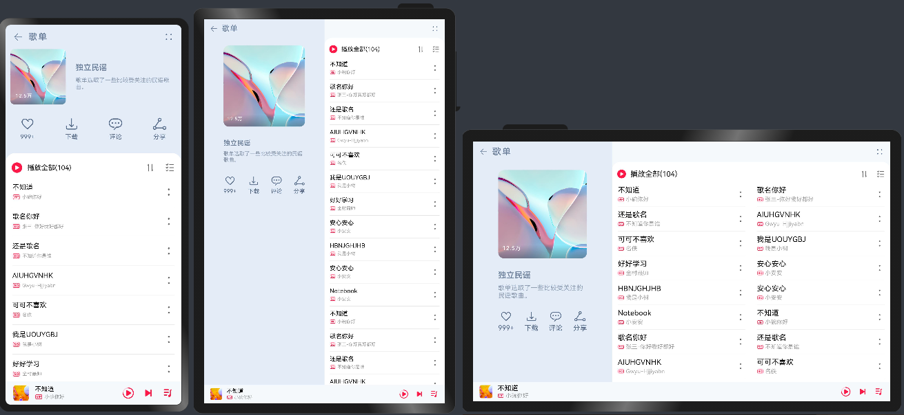

# 一多典型页面场景：音乐专辑页

### 介绍

本示例是[《一次开发，多端部署》](https://gitee.com/openharmony/docs/tree/master/zh-cn/application-dev/key-features/multi-device-app-dev)的配套示例代码，以“音乐专辑页”为例，展示了使用[栅格](https://gitee.com/openharmony/docs/blob/master/zh-cn/application-dev/key-features/multi-device-app-dev/responsive-layout.md#%E6%A0%85%E6%A0%BC%E5%B8%83%E5%B1%80)进行一多页面开发的核心流程：

- 基于UX设计图抽象出不同断点下的栅格布局图。
- 基于栅格布局图进行代码开发。

建议将本示例与《一次开发，多端部署》中的[“音乐专辑页”章节](https://gitee.com/openharmony/docs/blob/master/zh-cn/application-dev/key-features/multi-device-app-dev/music-album-page.md)搭配阅读及理解。

本示例中的音乐专辑页包含头部标题栏、专辑封面、歌单列表、播放器等。专辑封面区域使用栅格实现其内部元素在不同断点下的不同布局效果，同时整个页面也使用栅格调整专辑封面与歌单列表区域在不同断点下的相对位置。开发者可以分别查看上述两部分内容的实现，进一步了解栅格的使用。

### 效果预览

本示例在预览器中的效果：

本示例在开发板上运行的效果：

|全屏展示               |窗口操作按钮          |悬浮窗口显示          |
|---------------------|--------------------|--------------------|
||||

使用说明：

1.启动应用，查看本应用在全屏状态下的效果。

2.在应用顶部，下滑出现窗口操作按钮。（建议通过外接鼠标操作，接入鼠标只需要将鼠标移动至顶部即可出现窗口）

3.点击悬浮图标，将应用悬浮在其他界面上显示。

4.拖动应用悬浮窗口的四个顶角，改变窗口尺寸，触发应用显示刷新。改变窗口尺寸的过程中，窗口尺寸可能超出屏幕尺寸，此时在屏幕中只能看到应用部分区域的显示。可以通过移动窗口位置，查看应用其它区域的显示。

### 相关权限

不涉及。

### 依赖

不涉及。

### 约束与限制

1. 本示例仅支持在标准系统上运行。

2. 本示例仅支持API9版本的SDK，版本号： 3.2.5.5 Beta2。

3. 本示例需要使用DevEco Studio 3.0 Beta4 (Build Version: 3.0.0.992, built on July 14, 2022)才可编译运行。

4. 本示例在开发板上运行时，可以[修改开发板系统配置文件以开启自由窗口能力](https://gitee.com/openharmony/docs/blob/master/zh-cn/application-dev/key-features/multi-device-app-dev/faq.md#%E5%A6%82%E4%BD%95%E5%BC%80%E5%90%AF%E8%87%AA%E7%94%B1%E7%AA%97%E5%8F%A3)。

