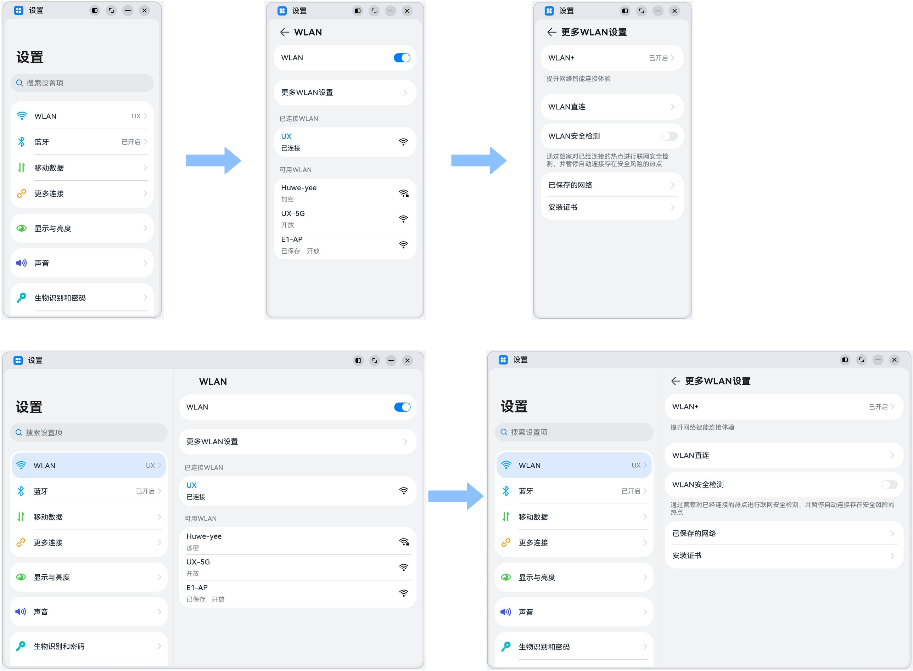
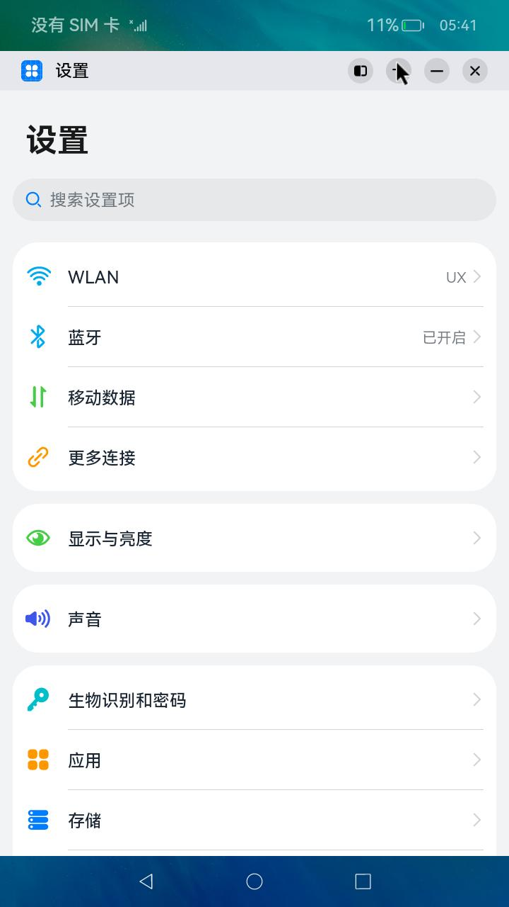
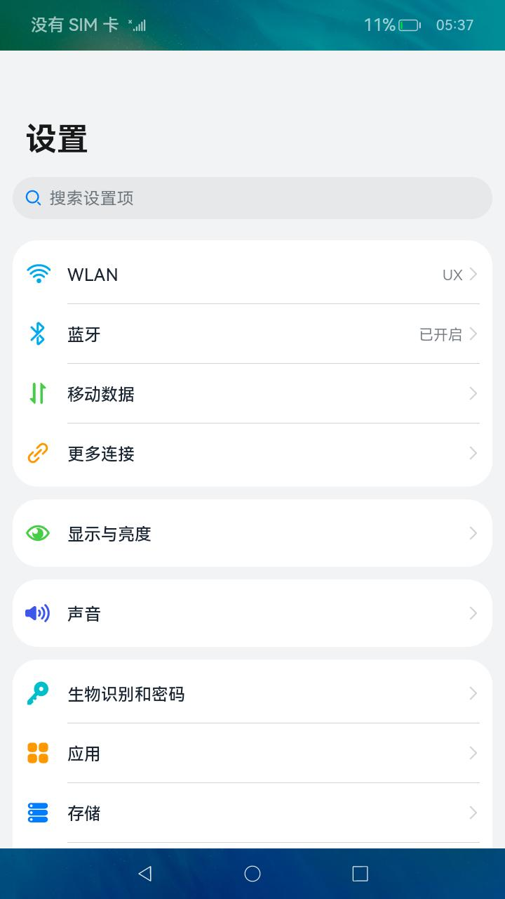
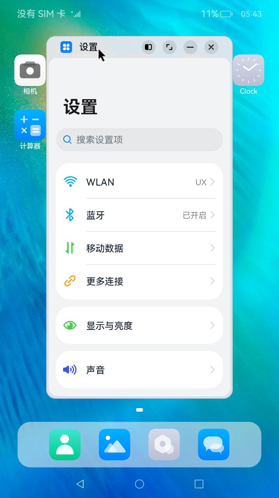

# 一多典型页面场景：设置应用页面

### 介绍

本示例是[《一次开发，多端部署》](https://gitee.com/openharmony/docs/tree/master/zh-cn/application-dev/key-features/multi-device-app-dev)的配套示例代码，以“设置应用页面”为例，展示了如何通过[Navigation组件](https://gitee.com/openharmony/docs/blob/master/zh-cn/application-dev/reference/arkui-ts/ts-basic-components-navigation.md)实现小屏设备下单栏显示、大屏设备上左右分栏显示的效果。建议将本示例与《一次开发，多端部署》中的[“设置应用页面”章节](https://gitee.com/openharmony/docs/blob/master/zh-cn/application-dev/key-features/multi-device-app-dev/settings-application-page.md)搭配阅读及理解。

### 效果预览

本示例在不同窗口尺寸下的显示效果。

本示例在开发板上的运行效果。

| 全屏显示                           | 窗口操作按钮                       | 悬浮显示                           |
| ---------------------------------- | ---------------------------------- | ---------------------------------- |
|  |  |  |

使用说明：

1. 启动应用，查看应用在全屏状态下的显示效果。
2. 依次点击`WLAN` -> `更多WLAN设置`，查看应用的显示效果。
3. 依次点击`更多连接`->`NFC`，查看应用的显示效果。
4. 在应用顶部，下滑出现窗口操作按钮。（建议通过外接鼠标操作，接入鼠标只需要将鼠标移动至顶部即可出现窗口）
5. 点击悬浮图标，将应用悬浮在桌面上显示。
6. 拖动应用悬浮窗口改变窗口尺寸，触发应用显示刷新。改变窗口尺寸的过程中，窗口尺寸可能超出屏幕尺寸，此时在屏幕中只能看到应用部分区域的显示。可以通过移动窗口位置，查看应用其它区域的显示。
7. 重复步骤2和3，查看应用在不同窗口尺寸下的显示效果。

### 相关权限

不涉及。

### 依赖

不涉及。

### 约束与限制

1. 本示例仅支持在标准系统上运行。
2. 本示例仅支持API9版本的SDK，版本号：3.2.10.6。
3. 本示例需要使用DevEco Studio 3.0 Release (Build Version: 3.0.0.993)才可编译运行。
5. 本示例在开发板上运行时，可以[修改开发板系统配置文件以开启自由窗口能力](https://gitee.com/openharmony/docs/blob/master/zh-cn/application-dev/key-features/multi-device-app-dev/faq.md#%E5%A6%82%E4%BD%95%E5%BC%80%E5%90%AF%E8%87%AA%E7%94%B1%E7%AA%97%E5%8F%A3)。

