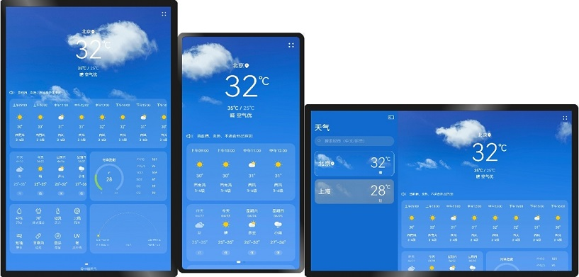

# 一多入门示例：天气应用

### 介绍

本示例是[《一次开发，多端部署》](https://gitee.com/openharmony/docs/tree/master/zh-cn/application-dev/key-features/multi-device-app-dev)的配套示例代码，以包含“首页、城市管理、添加城市、更新时间弹窗”等功能的“天气应用”为例，展示如何开发一多应用。《一次开发，多端部署》中的[“从一个例子开始”章节](https://gitee.com/openharmony/docs/blob/master/zh-cn/application-dev/key-features/multi-device-app-dev/start-with-a-example.md)以“天气应用”为例介绍了一多应用开发过程中涉及的主要流程（如UX设计、工程管理及调试、页面开发、功能开发等），建议将本示例与其一起搭配阅读和理解。

### 效果预览

使用说明：

1.启动应用后，首页展示已添加城市的天气信息，默认展示2个城市，左右滑动可以切换城市，在LG设备上，默认显示侧边栏，侧边栏显示时，右侧内容区占2/3，侧边栏隐藏时，内容区自动铺满界面。

2.在支持窗口自由拖拽的设备上，拖拽窗口大小，可以分别实现拖动到最大窗口侧边栏显示（点击侧边栏控制按钮可以隐藏和显示侧边栏），拖动窗口缩小到MD大小时侧边栏和侧边栏控制按钮隐藏。

3.在支持窗口自由拖拽的设备上，拖拽窗口大小，天气内容区跟随窗口大小会自动换行显示。

4.点击右上角菜单按钮，在菜单中点击**更新时间**，弹出更新时间弹窗，没有功能，此处只做展示，在平板设备上显示2列，在小屏设备上显示一列。

5.点击右上角菜单按钮，在菜单中点击**管理城市**，进入管理城市界面，展示已添加的城市，在平板设备上显示2列，在小屏设备上显示一列。

6.点击管理城市界面的**添加城市**，进入添加城市界面，已添加的城市不可点击，未添加的城市点击可以添加并返回管理城市界面显示。

### 相关权限

不涉及。

### 依赖

不涉及。

###  约束与限制

1. 本示例仅支持标准系统上运行。

2. 本示例仅支持API9版本SDK，版本号：3.2.5.5 Beta2。

3. 本示例需要使用DevEco Studio 3.0 Beta4 (Build Version: 3.0.0.992, built on July 14, 2022)才可编译运行。

4. 本示例在开发板上运行时，可以[修改开发板系统配置文件以开启自由窗口能力](https://gitee.com/openharmony/docs/blob/master/zh-cn/application-dev/key-features/multi-device-app-dev/faq.md#%E5%A6%82%E4%BD%95%E5%BC%80%E5%90%AF%E8%87%AA%E7%94%B1%E7%AA%97%E5%8F%A3)。

