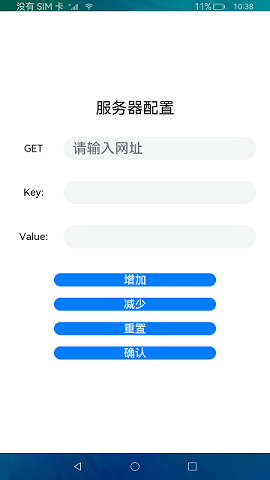

# 数据请求

### 简介

本示例仿postman输入API接口地址，获取相应数据，介绍数据请求接口的用法。效果图如下：

### 相关概念

数据请求：本模块提供http数据请求能力。应用可以通过HTTP发起一个数据请求，支持常见的GET、POST、OPTIONS、HEAD、PUT、DELETE、TRACE、CONNECT方法。

### 相关权限

网络服务：ohos.permission.INTERNET

### 使用说明

1.在输入框中输入待查询API接口地址。

2.如需设置参数，点击**设置参数**按钮跳转至参数设置页面，点击**增加**按钮增加待设置参数数目，点击**减少**按钮减少待设置参数数目，设置完成点击**确认**按钮提交参数设置。

3.点击**查询**按钮，向API接口发送数据请求，返回结果显示在下方文本框中。左右滑动文本框可查看响应体与响应头。

4.点击底部**清理**按钮，清空文本框中查询信息。

### 约束与限制

1.本示例仅支持在标准系统上运行，运行本实例需全程联网。

2.本示例需要使用DevEco Studio 3.0 Beta3 (Build Version: 3.0.0.901, built on May 30, 2022)才可编译运行。