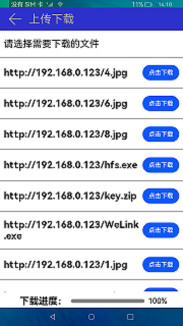

# Upload/Download

### Introduction

This sample demonstrates how to use the upload and download interfaces to upload and download files.

### Concepts

**Upload and download**

  Transfer files from a mobile phone to a remote server and vice versa.

### Required Permissions

The following permission must be declared in the **config.json** file:

"reqPermissions": [{"name": "ohos.permission.INTERNET"}]

### Usage Guidelines

1. Start the application and request for access to the remote server. A list of files on the remote server will be displayed. Select the file to download and click **download**. The file on the remote server is downloaded to the mobile phone, and the download progress is displayed.

2. Tap **next** to go to the upload page, and tap **upload**. The local file is uploaded to the remote server, and the upload progress is displayed.

### Constraints

1. This sample can only be run on standard-system devices.

2. This sample requires DevEco Studio 3.0 Beta4 (Build Version: 3.0.0.992, built on July 14, 2022) to compile and run.

3. HTTPS is supported by default. To support HTTP, you need to add the **network** field to the **config.json** file, and set the **cleartextTraffic** attribute to **true**, that is:
"deviceConfig": {
    "default": {
        "network": {
            "cleartextTraffic": true
        }
    }
}
