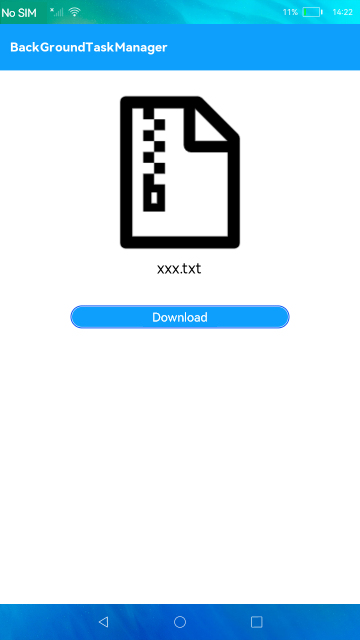

# Background Task Management

### Introduction

This sample shows how a download task can be performed at the background even if the app exits. The display effect is as follows:

### Concepts

If a service needs to be continued when the application or service module is running in the background (not visible to users), the application or service module can request a transient task to delay the suspension or a continuous task to prevent the suspension.

### Required Permissions

ohos.permission.KEEP_BACKGROUND_RUNNING

### Usage

1. Touch the **Download** button and exit the app. The download task is pushed to the background for execution. When a task starts to be executed in the background, a notification and the download progress will be displayed.

### Constraints

- This sample can only be run on standard-system devices.
- You need to refresh the notification window to view the download progress. In addition, the download ends when the download progress reaches 20% in this sample.
- This feature is supported form API version 9.

- This sample requires DevEco Studio 3.0 Beta4 (Build Version: 3.0.0.992, built on July 14, 2022) to compile and run.