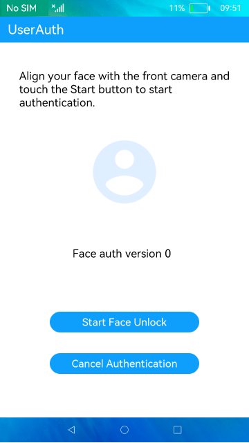

# User Authentication

### Introduction

This sample shows how to implement facial authentication. The display effect is as follows:

### Concepts

User authentication: The user authentication (UserAuth) module provides methods for checking the user authentication capability, and performing or canceling authentication. You can perform authentication based on biometric features such as facial characteristics.

### Required Permissions

ohos.permission.ACCESS_BIOMETRIC

### Usage

1. Open the home screen. The system checks whether the current device supports facial authentication and displays a dialog box.

2. Touch **Start Face Unlock** to start facial authentication. A dialog box is displayed showing the authentication result.

3. Touch **Cancel Authentication** to cancel facial authentication.

### Constraints

- This sample can only be run on standard-system devices.

- This sample applies only to the devices capable of facial authentication. Currently, the APIs provide the facial authentication capability, but no device supports this function.

- This sample is based on the stage model, which is supported from API version 9.

- DevEco Studio 3.0 Beta3 (Build version: 3.0.0.901, built on May 30, 2022) must be used.
