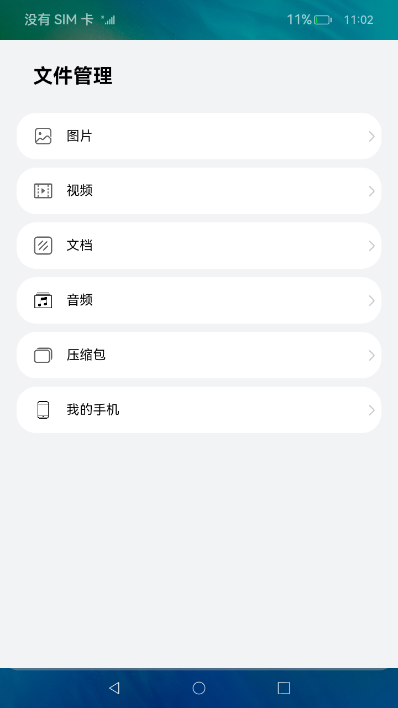
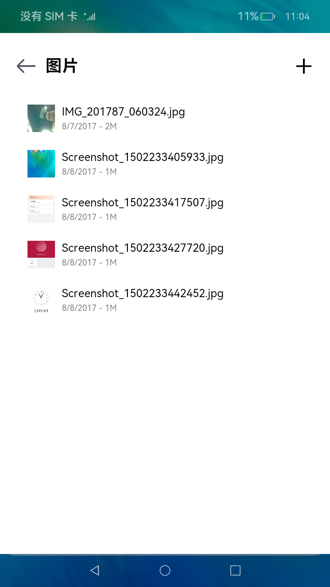
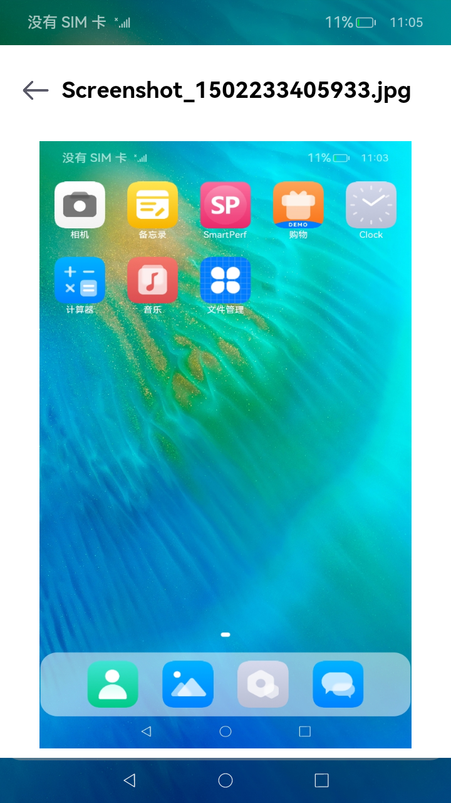
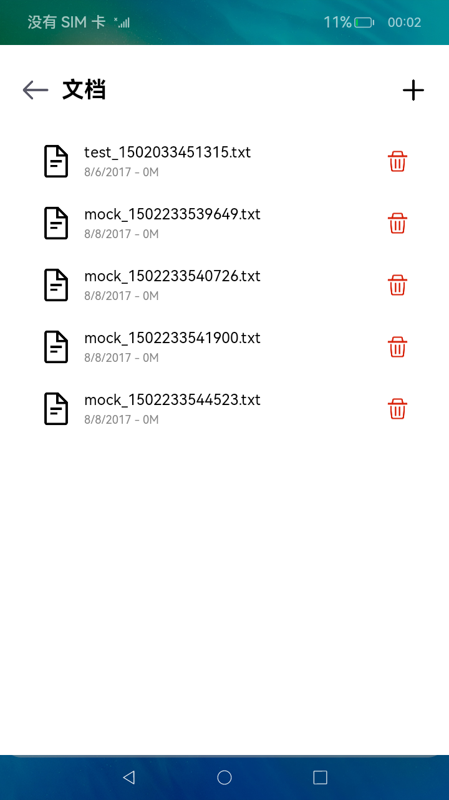

# 文件管理（标题以特性命名）

### 介绍

需要介绍本sample的主要实现原理，如使用了什么API、有什么关键性的配置和实现等等，附上链接，后面需要加上应用的使用说明，示例如下：

本示例主要展示了文件管理相关的功能，使用[@ohos.multimedia.medialibrary](https://gitee.com/openharmony/docs/blob/master/zh-cn/application-dev/reference/apis/js-apis-medialibrary.md)
、[@ohos.filemanagement.userFileManager](https://gitee.com/openharmony/docs/blob/master/zh-cn/application-dev/reference/apis/js-apis-userFileManager.md)
等接口，实现了增添文件、删除文件、查找指定类型文件文件和预览图片的功能;

### 效果预览

屏幕截屏或者视频，文件不超过4个，每张截屏图片不能太大，推荐占1/4页左右，每张图片附上图片标题，示例效果如下所示；

|主页|悬浮模式|列表|悬浮模式|
|--------------------------------|--------------------------------|--------------------------------|--------------------------------|
|||||

使用说明

依次介绍sample具有什么功能，怎样使用这些功能，以及使用后会达到什么效果；示例如下：

1. 在主界面，可以点击图片、视频、文档、音频等按钮进入对应目录的文件列表浏览界面；
2. 在文件列表浏览界面，点击“+”按钮，可以添加文件；
3. 在文件列表浏览界面，长按列表项会出现删除图片，点击删除图标可以删除文件；
4. 在图片文件列表界面，点击图片可以进入图片预览界面。

### 工程目录

给出项目中关键的目录结构并描述它们的作用，示例如下：

```
entry/src/main/ets/
|---Application
|---filemanager
|   |---data
|   |   |---FileDataSource.ets             // 懒加载数据格式
|   |---pages
|   |   |---audio
|   |   |   |---AudioFileList.ets          // 音频列表页面
|   |   |---common
|   |   |   |---FileList.ets               // 同类型文件列表展示页面，接收文件类型，展示特定类型的文件列表
|   |   |---document
|   |   |   |---DocumentFileList.ets       // 文档列表页面
|   |   |---image
|   |   |   |---ImageFileList.ets          // 图片列表页面
|   |   |   |---ImagePreview.ets           // 图片预览页面
|   |   |---video
|   |   |   |---VideoFileList.ets          // 视频列表页面
|   |   |---FileManagerHome.ets            // 首页主体内容
|---MainAbility
|---pages
|   |---index.ets                          // 首页
Library/src/main/ets/
|---filemanager
|   |---components
|   |   |---ThumbnailImage.ets             // 缩略图组件
|   |---fileio
|   |   |---FileIoManager.ts               // 文件管理，待开发
|   |---medialibrary
|   |   |---MediaLibraryManager.ts         // 主要封装了mediaLibrary库相关的接口，实现相关功能，如：对文件的增、删、查和图片预览功能
|   |---userfilemanager
|   |   |---UserFileManager.ts             // 封装userFileManager库相关的接口
|   |---FileManager.ts                     // 文件管理接口，统一封装了各模块对外提供的功能接口
|---mock                                   // 本地数据
|---utils                                  // 日志工具
```

### 具体实现

先描述功能都在哪个模块，再具体描述如何实现这些功能的，以及在哪里使用他们，附上文件链接；示例如下：
* 增添文件、删除文件、查找指定类型文件文件和预览图片的功能接口封装在MediaLibraryManager，源码参考：[MediaLibraryManager.ts](https://gitee.com/openharmony/applications_app_samples/blob/master/FileManager/FileManager/Library/src/main/ets/filemanager/medialibrary/MediaLibraryManager.ts)
    * 使用mediaLibrary.getMediaLibrary来获取MediaLibrary对象;
    * 读取每个文件的数据：使用MediaLibrary.getFileAssets读取满足条件的文件集合FetchFileResult，然后调用FetchFileResult.getFirstObject();
    * 创建模拟文件：使用MediaLibrary.getPublicDirectory()获取系统预定的目录，然后使用MediaLibrary.createAsset();
    * 删除指定路径的文件：使用MediaLibrary.deleteAsset();
    * 获取预览图：使用image.createImageSource()创建指定的文件资源ImageSource，然后调用ImageSource.createPixelMap()，接口参考：[@ohos.multimedia.image](https://gitee.com/openharmony/docs/blob/master/zh-cn/application-dev/reference/apis/js-apis-image.md) 。

* 在Library模块中通过封装FileManager向外提供功能接口，如MediaLibraryManager.getPixelMapByFileAsset()，源码参考：[FileManager.ts](https://gitee.com/openharmony/applications_app_samples/blob/master/FileManager/FileManager/Library/src/main/ets/filemanager/FileManager.ts)
    * 如效果预览中的**图片列表**，读取指定类型的文件：在[FileList.ets](https://gitee.com/openharmony/applications_app_samples/blob/master/FileManager/FileManager/entry/src/main/ets/filemanager/pages/common/FileList.ets)
      中调用FileManager.getFileAssets()；
    * 创建模拟文件：在[FileList.ets](https://gitee.com/openharmony/applications_app_samples/blob/master/FileManager/FileManager/entry/src/main/ets/filemanager/pages/common/FileList.ets)
      中调用FileManager.createTxtFileAsset()；
    * 删除指定路径的文件：在[FileList.ets](https://gitee.com/openharmony/applications_app_samples/blob/master/FileManager/FileManager/entry/src/main/ets/filemanager/pages/common/FileList.ets)
      中调用FileManager.deleteFileAsset()；
    * 获取缩略图：在[ThumbnailImage.ets](https://gitee.com/openharmony/applications_app_samples/blob/master/FileManager/FileManager/Library/src/main/ets/filemanager/components/ThumbnailImage.ets) 中调用FileManager.getThumbnail()；
    * 如效果预览中的**图片预览**，获取预览图：在[ImagePreview.ets](https://gitee.com/openharmony/applications_app_samples/blob/master/FileManager/FileManager/entry/src/main/ets/filemanager/pages/image/ImagePreview.ets) 中调用FileManager.getPixelMapByFileAsset()。
    
### 相关权限

附上使用到权限和链接，示例如下：

[ohos.permission.READ_MEDIA](https://gitee.com/openharmony/docs/blob/master/zh-cn/application-dev/security/permission-list.md)

[ohos.permission.WRITE_MEDIA](https://gitee.com/openharmony/docs/blob/master/zh-cn/application-dev/security/permission-list.md)

### 依赖

如果涉及依赖其他Sample，需要进行说明，并且附上链接；

### 约束与限制

描述一些设备、SDK版本、IDE版本、接口限制、签名等约束和限制，示例如下：

1. 本示例仅支持标准系统上运行，支持设备：RK3568;
2. 本示例仅支持API9版本SDK，版本号：3.2.7.5，本示例涉及使用系统接口：@ohos.multimedia.mediaLibrary中的deleteAsset接口，需要手动替换Full SDK才能编译通过，具体操作可参考[替换指南](https://gitee.com/openharmony/docs/blob/master/zh-cn/application-dev/quick-start/full-sdk-switch-guide.md)；
3. 本示例需要使用DevEco Studio 3.0 Release (Build Version: 3.0.0.993)才可编译运行；
4. 本示例涉及系统接口，需要配置系统应用签名，可以参考[特殊权限配置方法](https://docs.openharmony.cn/pages/v3.2Beta/zh-cn/application-dev/security/hapsigntool-overview.md/)，把配置文件中的“app-feature”字段信息改为“hos_system_app”。

### 下载

给出单独下载本工程的命令，在代码中替换工程目录并以/结尾，如下面示例中的 **FileManager/FileManager**，示例如下：

如需单独下载本工程，执行如下命令：

```
git init
git config core.sparsecheckout true
echo FileManager/FileManager/ > .git/info/sparse-checkout
git remote add origin https://gitee.com/openharmony/applications_app_samples.git
git pull origin master
```