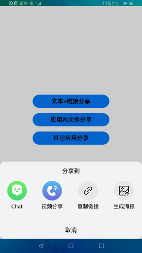
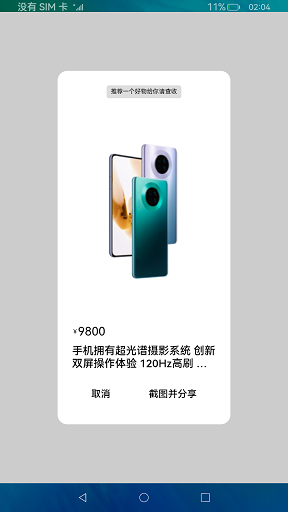
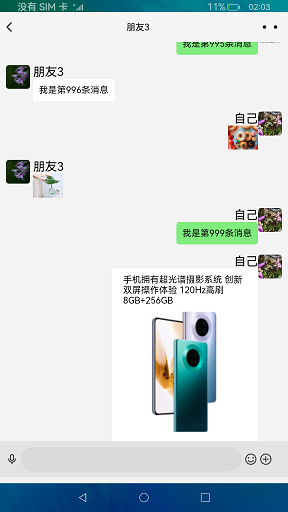

# 分享

### 介绍

分享的主要工作是实现；发送方将文本，链接，图片文件三种类型分享给三方应用,同时能够在三方应用中分别呈现出来。

本实例使用[数据请求](https://gitee.com/openharmony/docs/blob/master/zh-cn/application-dev/reference/apis/js-apis-http.md)

本实例使用[屏幕截屏](https://gitee.com/openharmony/docs/blob/master/zh-cn/application-dev/reference/apis/js-apis-screenshot.md)

本实例使用[图片处理](https://gitee.com/openharmony/docs/blob/master/zh-cn/application-dev/reference/apis/js-apis-image.md)

本实例使用[文件管理](https://gitee.com/openharmony/docs/blob/master/zh-cn/application-dev/reference/apis/js-apis-fileio.md)

本实例使用[媒体库管理](https://gitee.com/openharmony/docs/blob/master/zh-cn/application-dev/reference/apis/js-apis-medialibrary.md)

本实例使用[媒体服务](https://gitee.com/openharmony/docs/blob/master/zh-cn/application-dev/reference/apis/js-apis-media.md)

本实例使用[元能力](https://gitee.com/openharmony/docs/blob/master/zh-cn/application-dev/ability/stage-ability.md)

本实例使用[弹窗](https://gitee.com/openharmony/docs/blob/master/zh-cn/application-dev/reference/apis/js-apis-prompt.md)

使用方法：

1.启动Share应用,首页展示分享跳转页面,点击"分享"出现（三方APP的）弹窗;

2.分享文本\链接，选择"Chat"图标，会拉起三方应用[Chat](https://gitee.com/jiangwensai/applications_app_samples/tree/master/AppSample/Chat) ，此时选择[聊天列表](https://gitee.com/jiangwensai/applications_app_samples/blob/master/AppSample/Chat/entry/src/main/ets/MainAbility/pages/Index.ets) 任意朋友进行分享;

3.分享图片文件，选择"生成海报"图标，此时第一层弹窗消失并出现新的弹窗，点击"截图并分享"，会出现小提示"截图成功，分享加载中...",稍后会拉起三方应用[Chat](https://gitee.com/jiangwensai/applications_app_samples/tree/master/AppSample/Chat) ，此时选择[聊天列表](https://gitee.com/jiangwensai/applications_app_samples/blob/master/AppSample/Chat/entry/src/main/ets/MainAbility/pages/Index.ets) 任意朋友分享。

### 效果预览

 
 

### 相关权限

本示例需要在module.json5中配置如下权限:

允许应用截取屏幕图像：[ohos.permission.CAPTURE_SCREEN](https://gitee.com/openharmony/docs/blob/master/zh-cn/application-dev/security/permission-list.md)

允许使用Internet网络：[ ohos.permission.INTERNET](https://gitee.com/openharmony/docs/blob/master/zh-cn/application-dev/security/permission-list.md)

允许应用访问用户媒体文件中的地理位置信息：[ohos.permission.MEDIA_LOCATION](https://gitee.com/openharmony/docs/blob/master/zh-cn/application-dev/security/permission-list.md)

允许应用读取用户外部存储中的媒体文件信息：[ohos.permission.READ_MEDIA](https://gitee.com/openharmony/docs/blob/master/zh-cn/application-dev/security/permission-list.md)

### 依赖

依赖于[Chat](https://gitee.com/jiangwensai/applications_app_samples/tree/master/AppSample/Chat)应用，来作为接收方。

### 约束与限制

1.本示例仅支持标准系统上运行,支持设备:RK3568。

2.本示例需要使用DevEco Studio 3.0 Beta3 (Build Version: 3.0.0.991, built on May 30, 2022)才可编译运行。

3.本示例涉及相关权限为system_core级别（相关权限级别可通过[权限定义列表](https://gitee.com/openharmony/docs/blob/master/zh-cn/application-dev/security/permission-list.md) 查看），
需要手动配置对应级别的权限签名(具体操作可查看[自动化签名方案](https://developer.harmonyos.com/cn/docs/documentation/doc-guides/ohos-auto-configuring-signature-information-0000001271659465)) 。