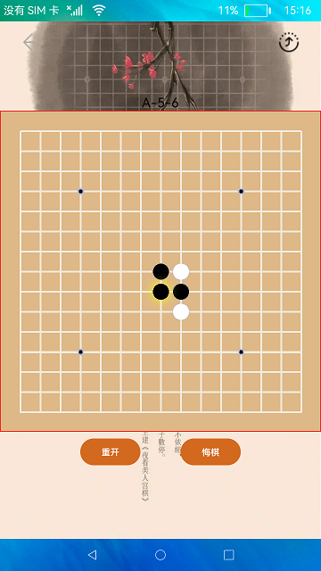

# 分布式五子棋

### 简介

五子棋是一款比较流行的棋类游戏，此游戏使用分布式数据管理功能进行开发完成的。实现效果如下：

### 相关概念

分布式数据管理：分布式数据管理为应用程序提供不同设备间数据库的分布式协同能力。通过调用分布式数据各个接口，应用程序可将数据保存到分布式数据库中，并可对分布式数据库中的数据进行增加、删除、修改、查询、同步等操作。

### 相关权限

允许不同设备间的数据交换：ohos.permission.DISTRIBUTED_DATASYNC

### 使用说明

1.启动应用，两个设备都确认权限后，并在同一个网络下，点击右上角图标，选择需要拉起的远程设备，点击后拉起远程设备，第一次拉起设备时，若未进行认证，输入认证码进行认证，认证成功后拉起远程设备。

2.游戏过程中，本地设备的用户可以重开，悔棋，远程设备无此功能。下子时，在棋盘某位置点击第一次时预下子，若确定下在该位置，继续点击该位置，若不确定，点击其他位置即可。若远程设备因特殊原因退出或者掉线，本地设备可重新拉起远程设备，拉起后，本地设备点击棋盘任意位置，数据会同步到远程设备，继续进行未完成的游戏。

### 约束与限制

1.本示例仅支持标准系统上运行。

2.本示例为Stage模型，从API version 9开始支持。

3.本示例需要使用DevEco Studio 3.0 Beta4 (Build Version： 3.0.0.992， built on July 14， 2022)才可编译运行。

4.本示例需要使用@ohos.distributedHardware.deviceManager系统权限的系统接口。使用Full SDK时需要手动从镜像站点获取，并在DevEco Studio中替换，具体操作可参考[替换指南](https://gitee.com/openharmony/docs/blob/master/zh-cn/application-dev/quick-start/full-sdk-switch-guide.md)。

