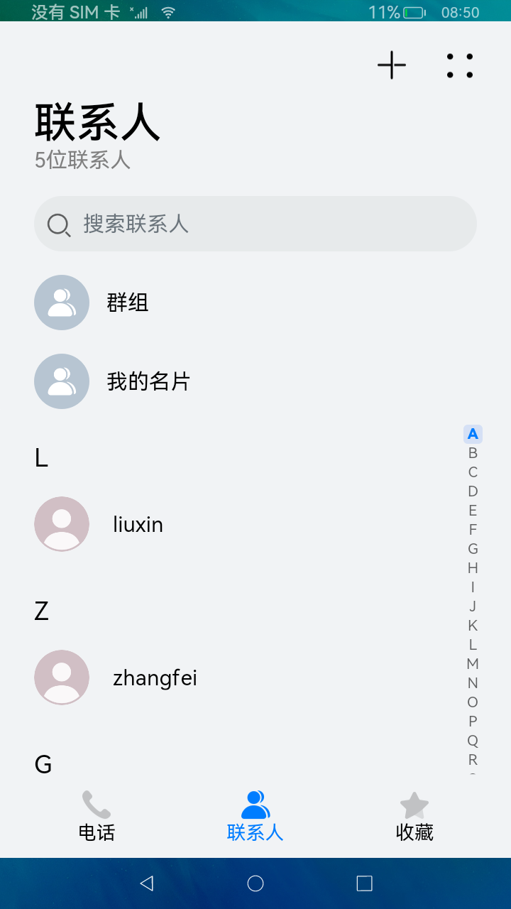
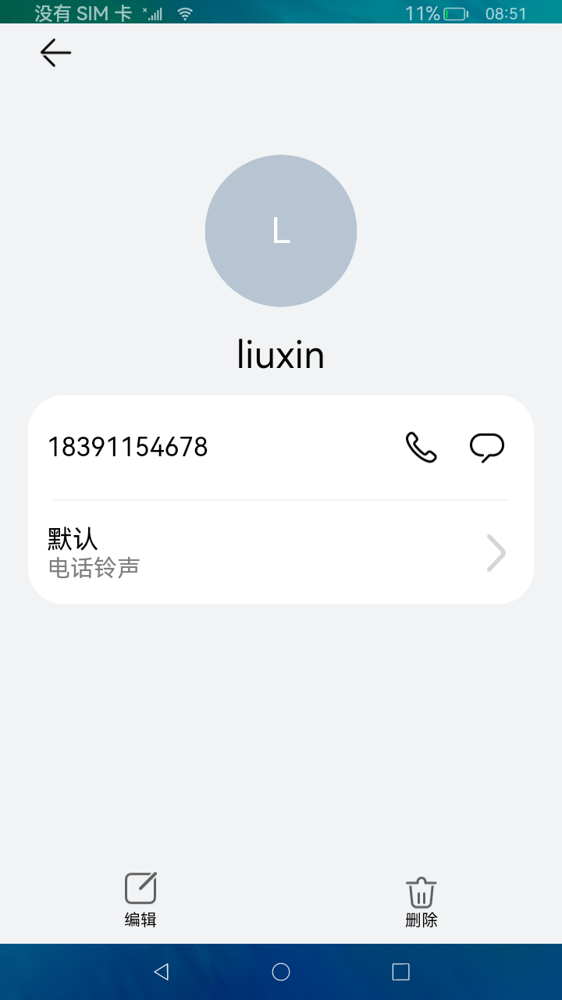

# 联系人

### 介绍

本示例展示手机联系人功能。

本示例使用[Tabs](https://gitee.com/openharmony/docs/blob/master/zh-cn/application-dev/reference/arkui-ts/ts-container-tabs.md)容器组件设置应用整体布局,在首页面中使用[List](https://gitee.com/openharmony/docs/blob/master/zh-cn/application-dev/reference/arkui-ts/ts-container-list.md)容器组件设置页面布局，再通过[AlphabetIndexer](https://gitee.com/openharmony/docs/blob/master/zh-cn/application-dev/reference/arkui-ts/ts-container-alphabet-indexer.md)组件设置索引导航条。

使用说明：

1.点击**+**按钮，跳转添加联系人界面，输入联系人信息，点击**√**，确认添加联系人，并返回首页。

2.点击联系人列表跳转页面查看详细信息，并且可以编辑或删除联系人信息。

3.在搜索栏输入号码或邮箱可查询对应的联系人。

### 效果预览

 

### 相关权限

允许应用读取联系人数据：[ohos.permission.READ_CONTACTS](https://gitee.com/openharmony/docs/blob/master/zh-cn/application-dev/security/permission-list.md)

允许应用添加、移除和更改联系人数据：[ohos.permission.WRITE_CONTACTS](https://gitee.com/openharmony/docs/blob/master/zh-cn/application-dev/security/permission-list.md)

### 依赖

不涉及。

### 约束与限制

1.本示例仅支持标准系统上运行，支持设备：RK3568。

2.本示例需要使用DevEco Studio 3.0 Beta4 (Build Version: 3.0.0.992, built on July 14, 2022)才可编译运行。

3.本示例涉及[ohos.permission.READ_CONTACTS](https://gitee.com/openharmony/docs/blob/master/zh-cn/application-dev/security/permission-list.md)、[ohos.permission.WRITE_CONTACTS](https://gitee.com/openharmony/docs/blob/master/zh-cn/application-dev/security/permission-list.md)为system_basic级别（相关权限级别可通过[权限定义列表](https://gitee.com/openharmony/docs/blob/master/zh-cn/application-dev/security/permission-list.md))查看），需要手动配置对应级别的权限签名(具体操作可查看[自动化签名方案](https://docs.openharmony.cn/pages/v3.2Beta/zh-cn/application-dev/security/hapsigntool-overview.md/))。