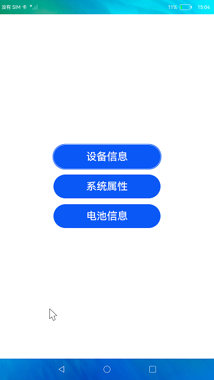

# 设备信息

### 简介

本示例通过deviceInfo、systemParameter和batteryInfo接口分别来查询设备信息、系统属性和电池信息。

实现效果如下：

### 相关概念

设备使用信息统计：包括app usage/notification usage/system usage等使用统计。例如应用使用信息统计，用于保存和查询应用使用详情（app usage）、事件日志数据（event log）、应用分组（bundle group）情况。 部件缓存的应用记录（使用历史统计和使用事件记录）会在事件上报后30分钟内刷新到数据库持久化保存。

### 相关权限

不涉及。

### 使用说明

分别点击对象的按钮框，查看对应的信息。

### 约束与限制

1.本示例仅支持在标准系统上运行。

2.本示例需要使用DevEco Studio 3.0 Beta4 (Build Version: 3.0.0.992, built on July 14, 2022)才可编译运行。

3.本示例需要使用@ohos.systemparameter系统权限的系统接口。使用Full SDK时需要手动从镜像站点获取，并在DevEco Studio中替换，具体操作可参考[替换指南](https://gitee.com/openharmony/docs/blob/master/zh-cn/application-dev/quick-start/full-sdk-switch-guide.md) 。