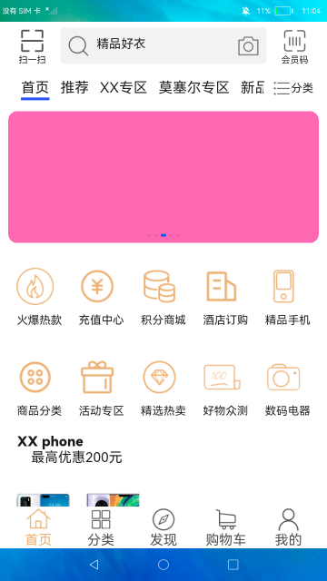

# 购物示例应用

### 简介

这是一个仿购物类的JS应用，使用了混合的布局，包含图片、视频、文本等资源。为了优化内存与性能体验，在滑动列表场景下使用了懒加载特性，开发者可借鉴使用。实现效果如下：

### 相关概念

通过JS基础组件和自定义组件实现混合布局。

### 相关权限

不涉及。

### 使用说明

1.应用设计包含多个页面，目前仅实现首页和详情页面。

2.首页包括文本图片的嵌套布局，使用list懒加载特性，实现滑动列表场景。

3.通过点击轮播图跳转到详情页，在详情页的swiper组件中嵌套图片与视频资源。

### 约束与限制

1.本示例仅支持在标准系统上运行。

2.本示例需要使用DevEco Studio 3.0 Beta4 (Build Version: 3.0.0.992, built on July 14, 2022)才可编译运行。
