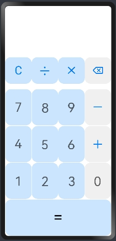

# ArkTS卡片计算器

### 介绍

本示例展示了使用ArkTS卡片开发的计算器模型。

### 效果预览



### 使用说明

1.部分设备的桌面不支持卡片，可以通过自己的开发卡片使用方，进行卡片的创建、更新和删除等操作。具体参考：[卡片使用方说明](../FormLauncher/README_zh.md)。

### 工程目录

```
entry/src/main/ets/
|---entryability
    |---EntryAbility.ts                    // Ability声明周期处理文件
|---entryformability
|   |---EntryFormAbility.ts                // 卡片声明周期处理文件
|---pages
|   |---index.ets                          // 首页
|---widget
|   |---pages
|   |   |---card.ets                       // 计算器卡片页面
```

### 相关权限

不涉及。

### 约束与限制

1.本示例仅支持标准系统上运行。

2.本示例为Stage模型，从API version 9开始支持。

3.本示例需要使用DevEco Studio 3.1 Release (Build Version: 3.1.0.400, built on March 29, 2023)才可编译运行。