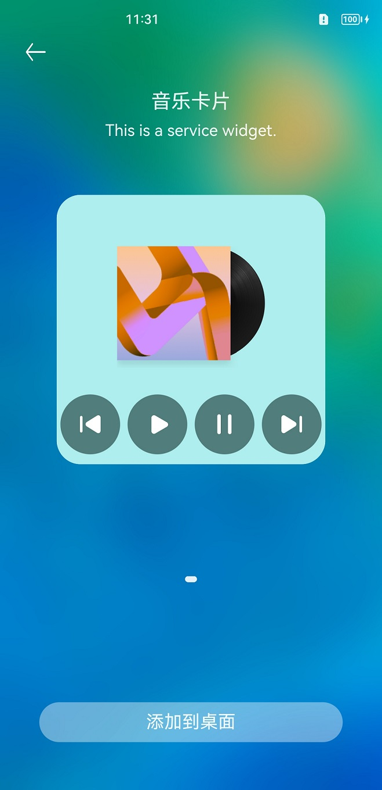
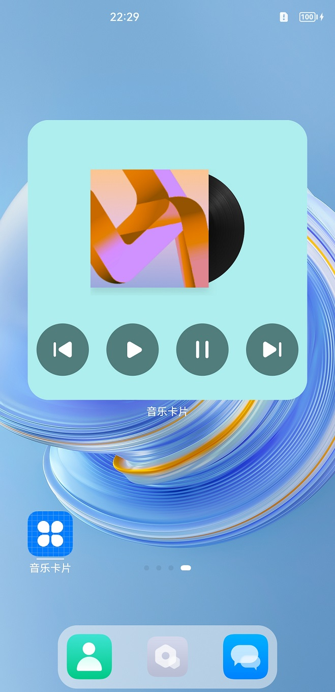

# ArkTs音乐卡片

### 介绍

本示例展示了如何通过ArkTs卡片实现一个简单的音乐卡片

### 效果预览

|服务卡片界面                                    |音乐卡片任务                                |
|---------------------------------------|-------------------------------------|
| ||

### 使用说明

1.安装应用，并在桌面上长按本应用的桌面图标，长按后弹出选项列表。

2.点击弹出列表中的服务卡片选项进入卡片添加界面。

3.点击正下方的添加到桌面按钮，卡片就会出现在桌面上。

### 工程目录

```
entry/src/main/ets/
|---feature
    |---BackgroundPlayerFeature.ts        // 音乐功能处理文件
|---mock
    |---BackgroundPlayerData.ts           // 音乐文件数据
|---MainAbility
    |---MainAbility.ts                    // Ability声明周期处理文件
|---Formability
|   |---FormAbility.ts                     // 卡片声明周期处理文件
|---pages
|   |---index.ets                          // 首页
|---widget
|   |---pages
|   |   |---card.ets                       // 音乐卡片页面
```

### 相关权限

[ohos.permission.KEEP_BACKGROUND_RUNNING](https://gitee.com/openharmony/docs/blob/master/zh-cn/application-dev/security/permission-list.md)

### 依赖

不涉及。

### 约束与限制

1.本示例仅支持标准系统上运行,支持设备：原型机；

2.本示例仅支持API9版本SDK，版本号：3.2.10.3 Beta4；

3.本示例需要使用DevEco Studio 3.1 Release (Build Version: 3.1.0.100, built on September 4, 2022)才可编译运行。