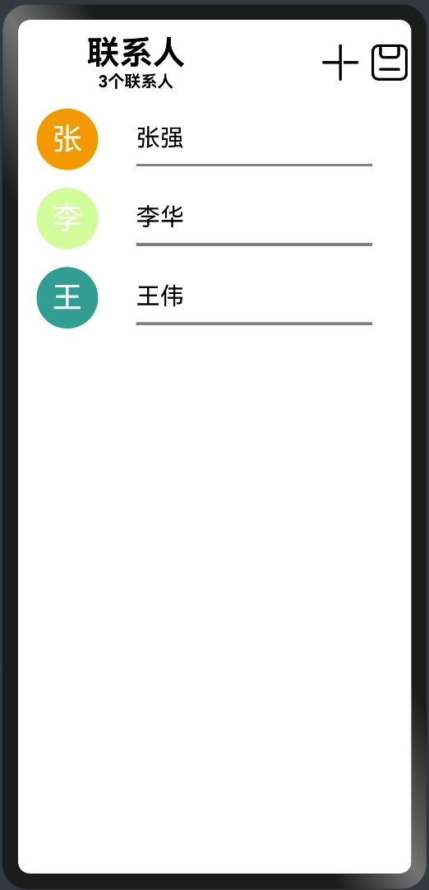
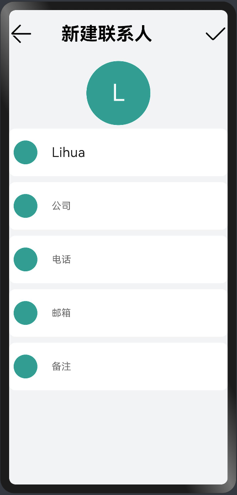

# 分布式联系人
## 简介
分布式联系人应用是展示分布式对象能力的Demo，包含：

1、增删改查联系人数据。

2、联系人数据本地持久化和恢复。

3、联系人数据跨设备同步。

## 主页面

  

## 使用步骤
1、新建联系人，点击右上角“+”号进入新建联系人页面。

2、查看联系人，点击列表进入联系人详情页，查看联系人详细信息。

3、删除联系人，长按列表删除联系人。

4、编辑联系人，进出联系人详情页，点击右上角编辑联系人。

4、保存联系人，点击右上角保存联系人到本地，分布式对象的持久化数据再下次应用启动恢复数据后会被删除。