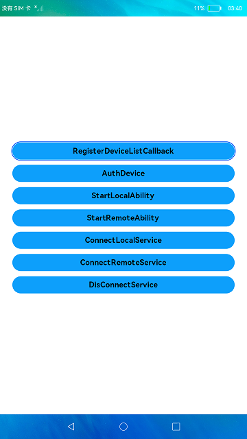

# Distributed Demo

### Introduction

This sample shows how to build distributed abilities and services. In this sample, you can:

1. Obtain a device through the API provided by the distributed hardware.

2. Start an ability on a remote device.

3. Bind a service on a remote device.

The display effect is as follows:

### Concepts

Distributed data service (DDS): The DDS implements distributed database collaboration across devices for applications. Applications save data to distributed databases by calling the DDS APIs. The DDS isolates data of different applications based on a triplet of account, application, and database to ensure secure data access. The DDS synchronizes application data between trusted devices to provide users with consistent data access experience on different devices.

### Required Permissions

ohos.permission.DISTRIBUTED_DATASYNC, which allows an application to exchange data with other devices.

### Usage

1. Connect two devices to the network.

2. Grant the permissions in the displayed dialog box.

3. On the home page of the sample app on one device, touch **RegisterDeviceListCallback** to register the device. After the registration is successful, touch **AuthDevice** to authenticate the device. Enter the corresponding PIN on the other device.

4. After the connection is successful, check that you can invoke the local ability, remote ability, local service, and remote service.

5. When you perform operations on either device, the data displayed on both devices is the same.

### Constraints

1. This sample can run only on standard-system devices, and API version 8 or later are supported.

2. DevEco Studio 3.0 Beta4 (Build version: 3.0.0.992, built on July 14, 2022) must be used.

3. This sample uses the system interface **@ohos.distributedHardware.deviceManager**. To use the Full SDK, you must manually obtain it from the mirror and switch to it in DevEco Studio. For details, see [Guide to Switching to Full SDK](https://gitee.com/openharmony/docs/blob/master/en/application-dev/quick-start/full-sdk-switch-guide.md).
