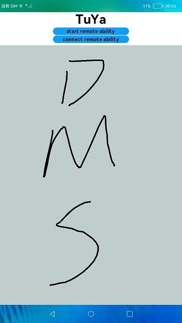

# 分布式涂鸦

### 简介

本示例展示了如何构建FA模型下分布式涂鸦Ability和Service，包含:

1.通过deviceManager提供的接口，获取设备ID（当前该接口未对三方应用开放）。

2.远程拉起对端FA。

3.远程绑定对端PA。

实现效果如下：

 

### 相关概念

FaultLogInfo：获取到的故障信息的数据结构。

### 相关权限

允许不同设备间的数据交换：ohos.permission.DISTRIBUTED_DATASYNC

### 使用说明

1.两台设备组网。

2.对弹出的分布式权限弹框进行授权。

3.在一台设备界面中点击start remote ability按钮，拉起远端FA。

4.继续点击connect remote ability按钮，绑定远端PA。

5.在按钮下方的画板进行涂鸦，可以看到远端设备也在同步涂鸦。

### 约束与限制

1.本示例仅支持标准系统上运行。

2.本示例需要使用DevEco Studio 3.0 Beta4 (Build Version: 3.0.0.992, built on July 14, 2022)才可编译运行。

3.本示例需要使用@ohos.distributedHardware.deviceManager系统权限的系统接口。使用Full SDK时需要手动从镜像站点获取，并在DevEco Studio中替换，具体操作可参考[替换指南](https://gitee.com/openharmony/docs/blob/master/zh-cn/application-dev/quick-start/full-sdk-switch-guide.md)。

