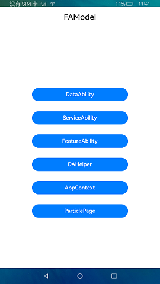

# FA模型

### 介绍

Ability框架在API 8及更早版本使用[FA模型](https://gitee.com/openharmony/docs/blob/master/zh-cn/application-dev/ability/fa-brief.md)。FA模型中Ability分为PageAbility、ServiceAbility、DataAbility、FormAbility几种类型。其中：

- PageAbility是具备ArkUI实现的Ability，是用户具体可见并可以交互的Ability实例。
- ServiceAbility也是Ability一种，但是没有UI，提供其他Ability调用自定义的服务，在后台运行。
- DataAbility也是没有UI的Ability，提供其他Ability进行数据的增删查服务，在后台运行。
- FormAbility是卡片Ability，是一种界面展示形式。

本示例主要展示FA模型与Stage模型的区别，分别从DataAbility、PageAbility（工程中对应MainAbility）、ServiceAbility、FA卡片、featureAbility、particleAbility、context模块进行介绍。

DataAbility：接口createRdbPredicates；通过createRdbPredicates创建DataAbilityHelper对象；通过rdb创建数据库，用来存放数据；通过DataAbilityHelper来访问数据库；通过dataAbility对数据库进行增删改查操作。

ServiceAbility：生命周期函数onStart、onCommand、onConnect、onDisconnect、onStop；通过featureAbility中的startAbility启动Service；通过connectAbility连接service；通过disconnectAbility断开service连接；通过rpc进行客户端与服务端通信。

FormAbility：生命周期函数onCreate、onCastToNormal、onUpdate、onVisibilityChange、onEvent、onDestroy、onAcquireFormState；通过formBindingData中的createFormBindingData创建卡片。

featureAbility： 提供UI设计与用户交互的能力 ， 包括启动新的ability、获取dataAbilityHelper、设置此Page Ability、获取当前Ability对应的窗口，连接服务等 。

particleAbility： 提供Service类型Ability的能力，包括启动、停止指定的particleAbility，获取dataAbilityHelper，连接、断开当前Ability与指定ServiceAbility等 。

context： 提供ability或application的上下文的能力，包括允许访问特定于应用程序的资源、请求和验证权限等。

PageAbility：应用的界面绘制。

#### FA和Stage模型的区别

1.在FA模型中主要配置文件config.json，需要时将对应的ability配置在config.json中module/abilites；对应Stage模型中主要有module.json5，需要时对应的ServiceExtAbility等须配置在module.json5中的extensionAbilities中，Page页面的Ability在abilites中。

2.Stage模型中卡片的创建需要的配置文件在resources/base/profile/form_config.json。

3.FA模型中ability生命周期与Stage模型生命周期区别：

FA模型生命周期[具体参考文档](https://gitee.com/openharmony/docs/blob/master/zh-cn/application-dev/ability/fa-brief.md#生命周期) ；Stage模型生命周期[具体参考文档](https://gitee.com/openharmony/docs/blob/master/zh-cn/application-dev/ability/stage-brief.md#生命周期) 。

4.FA模型中dataAbility对应Stage模型中DataShareExtensionAbility，具体实现差异详见方法注释。

5.FA模型中ServiceAbility对应Stage模型中ServiceExtensionAbility，具体实现差异详见方法注释。

6.FA模型中DataAbilityHelper对应stage模型DataShareHelper。

7.FA模型通过导入@ohos.resourceManager， 获取应用资源信息 ；Stage模型从API Version9开始，通过context获取resourceManager对象的方式，再调用其内部获取资源的接口， 无需再导入 @ohos.resourceManager。

#### FA对应Stage接口（FA-->Stage）

**FeatureAbility——>AbilityContext、dataShare接口：**

[FeatureAbilityHelper](./entry/src/main/ets/MainAbility/feature/FeatureAbilityHelper.ts)：getWant——>MainAbility：want

[FeatureAbilityHelper](./entry/src/main/ets/MainAbility/feature/FeatureAbilityHelper.ts)：startAbilityForResult——>AbilityContextController：startAbilityForResult

[FeatureAbilityHelper](./entry/src/main/ets/MainAbility/feature/FeatureAbilityHelper.ts)：acquireDataAbilityHelper——>DataShareHelper：createDataShareHelper

[FeatureAbilityHelper](./entry/src/main/ets/MainAbility/feature/FeatureAbilityHelper.ts)：terminateSelfWithResult——>AbilityContextController：terminateSelfWithResult

[FeatureAbilityHelper](./entry/src/main/ets/MainAbility/feature/FeatureAbilityHelper.ts)：hasWindowFocus——>Stage模型不支持

[FeatureAbilityHelper](./entry/src/main/ets/MainAbility/feature/FeatureAbilityHelper.ts)：terminateSelf——>AbilityContextController：terminateSelf

[FeatureAbilityHelper](./entry/src/main/ets/MainAbility/feature/FeatureAbilityHelper.ts)：getWindow——>WindowController：getTopWindow

[FeatureAbilityHelper](./entry/src/main/ets/MainAbility/feature/FeatureAbilityHelper.ts)：startServiceAbility——>AbilityContextController：startAbility

[FeatureAbilityHelper](./entry/src/main/ets/MainAbility/feature/FeatureAbilityHelper.ts)：connectService——>AbilityContextController：connectAbility

[FeatureAbilityHelper](./entry/src/main/ets/MainAbility/feature/FeatureAbilityHelper.ts)：disconnectService——>AbilityContextController：disconnectAbility

**context-->AbilityContext、Bundle、Window、abilityAccessCtrl接口：**

[AppContext](./entry/src/main/ets/MainAbility/feature/AppContext.ts)：getOrCreateLocalDir——>BundleController：entryDir

[AppContext](./entry/src/main/ets/MainAbility/feature/AppContext.ts)：verifyPermission——>AbilityAccessCtrlController：verifyAccessToken

[AppContext](./entry/src/main/ets/MainAbility/feature/AppContext.ts)：requestPermissionsFromUser——>AbilityContextController：requestPermissionsFromUser

[AppContext](./entry/src/main/ets/MainAbility/feature/AppContext.ts)：getApplicationInfo——>BundleController：getApplicationInfo

[AppContext](./entry/src/main/ets/MainAbility/feature/AppContext.ts)：getBundleName——>AbilityContextPage：abilityInfo.bundleName（属性）

[AppContext](./entry/src/main/ets/MainAbility/feature/AppContext.ts)：getDisplayOrientation——>AbilityContextPage：config.direction（属性）

[AppContext](./entry/src/main/ets/MainAbility/feature/AppContext.ts)：setDisplayOrientation——>WindowController：setPreferredOrientation

[AppContext](./entry/src/main/ets/MainAbility/feature/AppContext.ts)：setShowOnLockScreen——>MainAbility：setShowOnLockScreen

[AppContext](./entry/src/main/ets/MainAbility/feature/AppContext.ts)：setWakeUpScreen——>WindowController：setWakeUpScreen

[AppContext](./entry/src/main/ets/MainAbility/feature/AppContext.ts)：getProcessInfo——>AbilityContextPage：abilityInfo.descriptionId；abilityInfo.name（属性）

[AppContext](./entry/src/main/ets/MainAbility/feature/AppContext.ts)：getElementName——>BundleController：getAbilityInfo

[AppContext](./entry/src/main/ets/MainAbility/feature/AppContext.ts)：getProcessName——>BundleController：process

[AppContext](./entry/src/main/ets/MainAbility/feature/AppContext.ts)：getCallingBundle——>want.parameters（属性）

[AppContext](./entry/src/main/ets/MainAbility/feature/AppContext.ts)：getCacheDir——>AbilityContextPage：cacheDir（属性）

[AppContext](./entry/src/main/ets/MainAbility/feature/AppContext.ts)：getFilesDir——>AbilityContextPage：filesDir（属性）

[AppContext](./entry/src/main/ets/MainAbility/feature/AppContext.ts)：getOrCreateDistributedDir——>AbilityContextPage：distributedFilesDir（属性）

[AppContext](./entry/src/main/ets/MainAbility/feature/AppContext.ts)：getAppType——>BundleController：entityType

[AppContext](./entry/src/main/ets/MainAbility/feature/AppContext.ts)：getHapModuleInfo——>AbilityContextPage：currentHapModuleInfo（属性）

[AppContext](./entry/src/main/ets/MainAbility/feature/AppContext.ts)：getAppVersionInfo——>BundleController.getDispatcherVersion

[AppContext](../FaModel/entry/src/main/ets/MainAbility/feature/AppContext.ts)：getAbilityInfo——>AbilityContextPage：abilityInfo（属性）

[AppContext](./entry/src/main/ets/MainAbility/feature/AppContext.ts)：getApplicationContext——>AbilityContextPage：getApplicationContext()

[AppContext](./entry/src/main/ets/MainAbility/feature/AppContext.ts)：isUpdatingConfigurations——>Stage模型不支持

[AppContext](./entry/src/main/ets/MainAbility/feature/AppContext.ts)：printDrawnCompleted——>Stage模型不支持

**ParticleAbility ——>ServiceExtensionContext、dataShare接口：**

[ParticleAbilityHelper](./entry/src/main/ets/MainAbility/feature/ParticleAbilityHelper.ts) ：startAbility——>ServiceExtContextController：startAbility

[ParticleAbilityHelper](./entry/src/main/ets/MainAbility/feature/ParticleAbilityHelper.ts) ：connectAbility——>ServiceExtContextController：connectAbility

[ParticleAbilityHelper](./entry/src/main/ets/MainAbility/feature/ParticleAbilityHelper.ts) ：disconnectAbility——>ServiceExtContextController：disconnectAbility

[ParticleAbilityHelper](./entry/src/main/ets/MainAbility/feature/ParticleAbilityHelper.ts)：terminateSelf——>ServiceExtContextController：terminateSelf

[ParticleAbilityHelper](./entry/src/main/ets/MainAbility/feature/ParticleAbilityHelper.ts) ：acquireDataAbilityHelper——>DataShareHelper：createDataShareHelper

#### 使用说明

1.按照各按钮名称测试相应的接口功能。

#### 效果预览

### 相关权限

不涉及。

### 依赖

FaModel升级StageModel，对应的StageModel参考[StageModel](../StageModel)。

### 约束与限制

1.本示例仅支持在标准系统上运行，支持设备：RK3568。

2.本示例仅支持API9版本SDK，版本号：3.2.5.5。

3.本示例需要使用DevEco Studio 3.0 Beta4 (Build Version: 3.0.0.992, built on July 14, 2022)才可编译运行。

