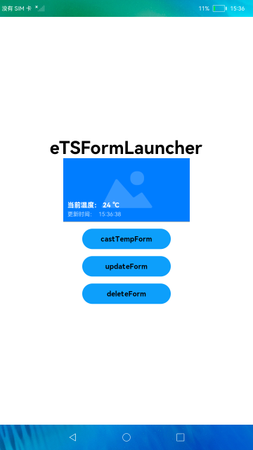

# 卡片使用方

### 简介

本示例展示了FA模型卡片使用方的创建与使用，包括创建与展示卡片、转换卡片、更新卡片、删除卡片等功能。实现效果如下：

### 相关概念

卡片使用方：显示卡片内容的宿主应用，控制卡片在宿主中展示的位置。

卡片管理服务：用于管理系统中所添加卡片的常驻代理服务，包括卡片对象的管理与使用，以及卡片周期性刷新等。

### 相关权限

允许应用查询其他应用的信息：ohos.permission.GET_BUNDLE_INFO_PRIVILEGED
允许应用获取Ability Form：ohos.permission.REQUIRE_FORM

### 使用说明

1.启动应用，拉起MainAbility，页面正常显示**eTSFormLauncher**字样。

2.若此时已安装对应的卡片提供方应用，则会显示出卡片。

3.点击**castTempForm**按钮，则会把临时卡片转换为常规卡片。

4.点击**updateForm**按钮，则会更新卡片。

5.点击**deleteForm**按钮，则会删除卡片。

### 约束与限制

1.本示例仅支持标准系统上运行。

2.本示例需要使用DevEco Studio 3.0 Beta4 (Build Version: 3.0.0.992, built on July 14, 2022)才可编译运行。

3.本示例需要使用@ohos.application.formHost系统权限的系统接口。使用Full SDK时需要手动从镜像站点获取，并在DevEco Studio中替换，具体操作可参考[替换指南](https://gitee.com/openharmony/docs/blob/master/zh-cn/application-dev/quick-start/full-sdk-switch-guide.md)。

4.本示例所配置的权限ohos.permission.GET_BUNDLE_INFO_PRIVILEGED、ohos.permission.REQUIRE_FORM为system_basic级别(相关权限级别可通过[权限定义列表](https://gitee.com/openharmony/docs/blob/master/zh-cn/application-dev/security/permission-list.md)查看)，需要手动配置对应级别的权限签名(具体操作可查看[自动化签名方案](https://docs.openharmony.cn/pages/v3.2Beta/zh-cn/application-dev/security/hapsigntool-overview.md/))。