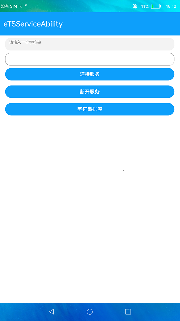

#  ServiceAbility的创建与使用

### 简介

本示例展示了ServiceAbility的创建与使用。效果图如下：

### 相关概念

ServiceAbility：基于Service模板的Ability（以下简称“Service”）主要用于后台运行任务（如执行音乐播放、文件下载等），但不提供用户交互界面。Service可由其他应用或Ability启动。即使用户切换到其他应用，Service仍将在后台继续运行。

### 相关权限

不涉及。

### 使用说明

1.启动应用后，点击**连接服务**，连接Service成功后会弹出提示。

2.连接服务成功后，在界面上输入框中输入一个字符串，点击**字符串排序**会将字符串发送到Service中，Service对字符串做排序处理后返回给当前应用界面并显示在文本框中。

3.点击**断开服务**，断开Service后会弹出提示。

### 约束与限制

1.本示例仅支持标准系统上运行。

2.本示例需要使用DevEco Studio 3.0 Beta4 (Build Version: 3.0.0.992, built on July 14, 2022)才可编译运行。
