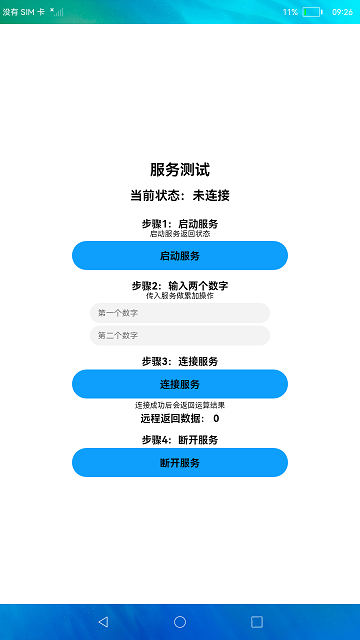
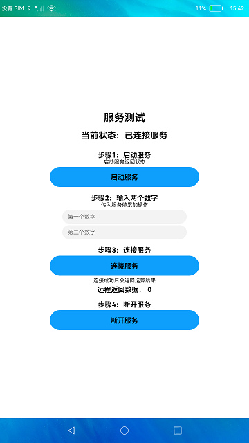

#  ServiceExtAbility的创建与使用

### 简介

本示例展示了ServiceExtAbility的创建与使用。实现效果如下：

 

### 相关概念

FaultLogInfo：获取到的故障信息的数据结构。

querySelfFaultLog：获取当前进程故障信息，该方法通过回调方式获取故障信息数组，故障信息数组内最多上报10份故障信息。

### 相关权限

不涉及。

### 使用说明

1.启动应用后，点击**启动服务**，会显示服务启动状态。

2.输入两个数字，传入service做累加操作。

3.点击**连接服务**，会显示服务连接状态。

3.连接服务成功后，会将本地输入发送到Service中，Service对数据进行累加运算后返回给本地应用，并在本地应用界面显示运算结果。

4.点击**断开服务**，断开Service，显示服务断开状态。

### 约束与限制

1.本示例仅支持标准系统上运行。

2.本示例为Stage模型，从API version 9开始支持。

3.本示例需要使用DevEco Studio 3.0 Beta4 (Build Version: 3.0.0.992, built on July 14, 2022)才可编译运行。

4.本示例使用了ServiceExtensionAbility相关系统接口，需要替换Full SDK，使用Full SDK时需要手动从镜像站点获取，并在DevEco Studio中替换，具体操作可参考[替换指南](https://gitee.com/openharmony/docs/blob/master/zh-cn/application-dev/quick-start/full-sdk-switch-guide.md)。

5.本示例使用了ServiceExtensionAbility，需要在签名证书UnsgnedReleasedProfileTemplate.json中配置"app-privilege-capabilities": ["AllowAppUsePrivilegeExtension"]，否则安装失败。具体操作指南可参考[应用特权配置指南](https://gitee.com/openharmony/docs/blob/eb73c9e9dcdd421131f33bb8ed6ddc030881d06f/zh-cn/device-dev/subsystems/subsys-app-privilege-config-guide.md)。           