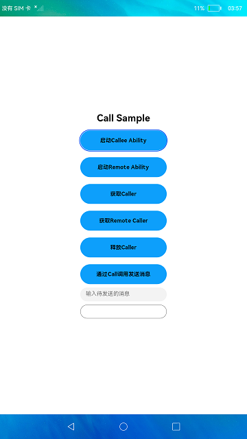
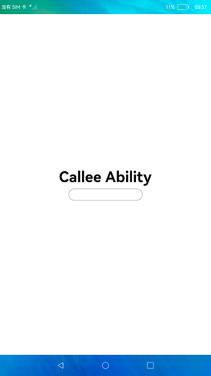

# StageCallAbility的创建与使用

### 简介

本示例展示了Stage模型启动Ability及Call功能的使用，包括拉起另一个Ability、创建Callee被调用端以及访问Callee被调用端。效果图如下：

 

### 相关概念

Call调用：Ability Call调用是Ability能力的扩展，它为Ability提供一种能够被外部调用的能力，使Ability既能被拉起到前台展示UI，也支持Ability在后台被创建并运行。应用开发者可通过Call调用，使用IPC通信实现不同Ability之间的数据共享。

### 相关权限

允许不同设备间的数据交换：ohos.permission.DISTRIBUTED_DATASYNC

### 使用说明

1.启动应用，拉起MainAbility，页面正常显示**Call Sample**字样。

2.点击**启动Callee Ability**按钮，触发拉起CalleeAbility，页面显示**Callee Ability**字样。

3.切换到MainAbility的页面，点击**获取Caller**按钮获取Caller通信接口，MainAbility为Caller调用端，CalleeAbility为被调用端。此操作不会将CalleeAbility的页面切换到前台展示。

4.在输入框**输入待发送的消息**输入要传递给CalleeAbility的序列化数据，比如"play music"。

5.点击**通过Call调用发送消息**按钮，触发将步骤4中输入的字符串序列化后传递给Callee被调用端，在MainAbility的页面显示消息发送成功**send play music succeed**。与此同时，切换到CalleeAbility的页面，页面显示Caller发送的数据**play music**。

6.点击**释放Caller**按钮，释放Caller通信接口，Caller被释放后MainAbility无法发送数据给CalleeAbility。

### 约束与限制

1.本示例仅支持标准系统上运行。

2.本示例为Stage模型，从API version 9开始支持。

3.本示例需要使用DevEco Studio 3.0 Beta4 (Build Version: 3.0.0.992, built on July 14, 2022)才可编译运行。

4.本示例需要使用@ohos.distributedHardware.deviceManager系统权限的系统接口。使用Full SDK时需要手动从镜像站点获取，并在DevEco Studio中替换，具体操作可参考[替换指南](https://gitee.com/openharmony/docs/blob/master/zh-cn/application-dev/quick-start/full-sdk-switch-guide.md)。