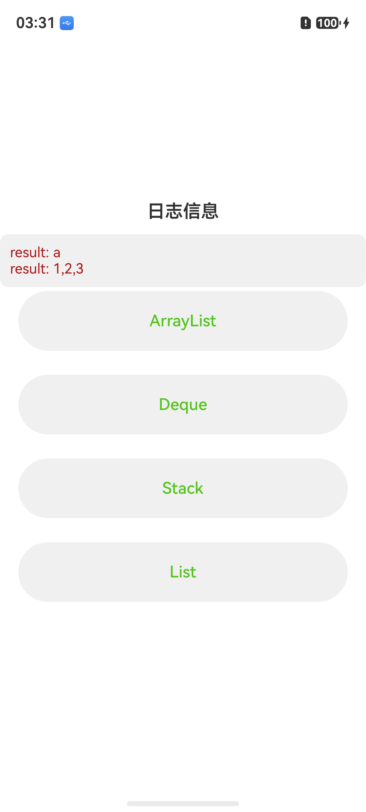

# 线性容器

## 介绍

线性容器实现能按顺序访问的数据结构，其底层主要通过数组实现，包括ArrayList、Vector、List、LinkedList、Deque、Queue和Stack。

## 效果预览

| 首页                                |
|-----------------------------------|
|  |

## 工程目录

```
├───entry/src/main/ets
│   ├───pages                               
│   │   └───Index.ets                                        // 首页。
└───entry/src/main/resources                                 // 资源目录。         
```

## 具体实现

* 线性容器
    * 源码参考：[Index.ets](./entry/src/main/ets/pages/Index.ets)
    * 使用流程：
    * 点击'测试ArrayList'按钮，可看到线性容器ArrayList的'add'作结果。
    * 点击'测试Deque'按钮，可看到线性容器Deque的'insertFront'、'insertEnd'操作结果。
    * 点击'测试Stack'按钮，可看到线性容器Stack的'push'操作结果。
    * 点击'测试List'按钮，可看到线性容器List的'insert'操作结果。

## 依赖

不涉及。

## 相关权限

不涉及。

## 约束与限制

1.  本示例仅支持在标准系统上运行。

2.  本示例推荐使用当前最新版本的API和SDK编译运行。

3. 本示例推荐使用当前最新版本的DevEco Studio。

4. 高等级APL特殊签名说明：无。

## 下载

如需单独下载本工程，执行如下命令：

```git
git init
git config core.sparsecheckout true
echo code/ArkTS-Sta/ArkTSRuntimeCoreLibrary/ArkTSContainerLibrary/LinearContainers > .git/info/sparse-checkout
git remote add origin OpenHarmony/applications_app_samples
git pull origin OpenHarmony_feature_sta_20260331