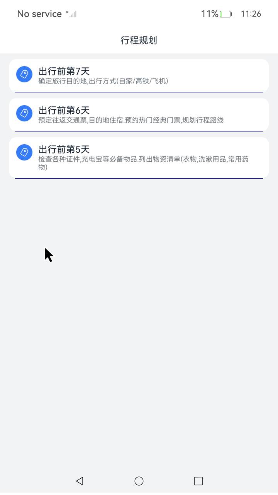

# ArkUI使用组件扩展文档示例

## 介绍

在一些主页的场景中，开发者可以在初始化自定义组件时，使用不同的方式（如尾随闭包等）对@BuilderParam装饰的自定义构建函数进行传参赋值。本示例主要讲解如何在使用尾随闭包后，使用多个@BuilderParam装饰的属性且支持使用通用属性。

## 效果预览

| 效果图 |
|-----------------------------------|
|  |

## 使用说明

1. 在主界面，可以点击对应卡片，选择需要参考的组件示例。

## 工程目录
```
entry/src/main/ets/
|---BuilderParamSample
|---pages
|   |---Index.ets                       // 应用主页面
|   |---Card.ets                        // @BuilderParam装饰器：引用@Builder函数
```
## 具体实现

* 使用尾随闭包后，支持使用多个@BuilderParam装饰的属性且支持使用通用属性，源码参考：
[Card.ets](entry/src/main/ets/pages/Card.ets)。

## 相关权限

不涉及。

## 依赖

不涉及。

## 约束与限制

1.本示例仅支持标准系统上运行，支持设备：Phone。

2.本示例为Stage模型，支持API23版本SDK，本示例SDK版本号(API Version 23)。

3.本示例需要使用DevEco Studio 版本号(6.0.0.91)版本才可编译运行。

## 下载

如需单独下载本工程，执行如下命令：

````
git init
git config core.sparsecheckout true
echo code/ArkTS1.2/BuilderParamSample/ > .git/info/sparse-checkout
git remote add origin https://gitcode.com/openharmony/applications_app_samples.git
git pull
````