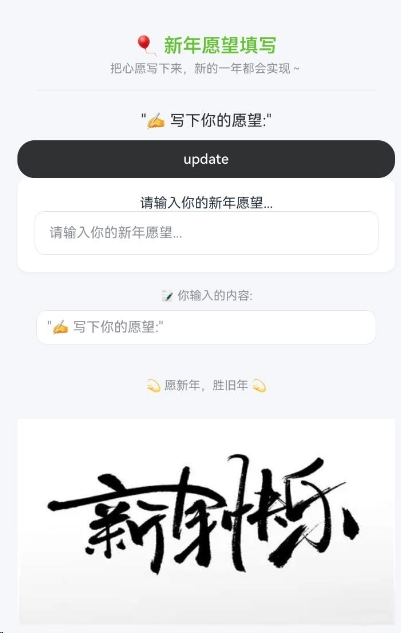
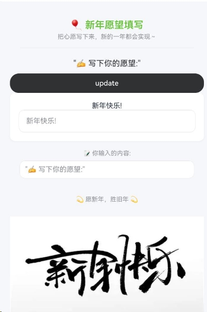
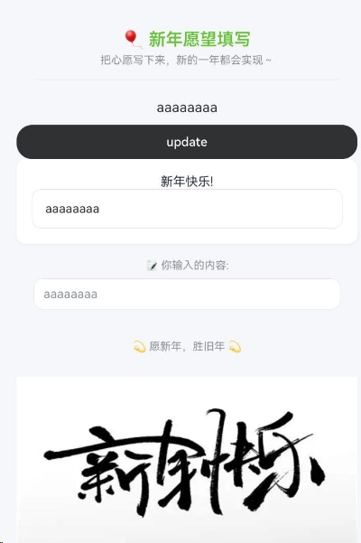

# Builder中支持状态变量刷新

## 介绍

Builder能够灵活实现不同层级组件间的互相传值，同时可将UI展示与底层变量进行绑定，当变量数据发生变更时，触发其管辖区域内的UI局部刷新，从而高效实现UI变量的实时更新。

## 效果预览

效果如下所示：

|子父组件互相传值修改UI案例|
|--------------------------------|
原版Demo
||
点击update
||
输入框输入消息
||

使用说明

本示例主要讲解如何使用@Builder如何子父组件互相传值,刷新变量UI显示。

## 工程目录

```
entry/src/main/ets/
|---common
|   |---Contants.ets
|---components
|   |---Bottom.ets
|   |---Header.ets
|   |---MainPage.ets
|---entryability
|   |---EntryAbility.ets
|---model
|   |---ResModel.ets
|---pages
|   |---Index.ets
```

## 具体实现

* Builder中支持状态变量刷新，源码参考：
[Bottom.ets](entry/src/main/ets/components/Bottom.ets);
[Header.ets](entry/src/main/ets/components/Header.ets);
[MainPage.ets](entry/src/main/ets/components/MainPage.ets);
[Index.ets](entry/src/main/ets/pages/Index.ets);

## 相关权限

无

## 依赖

无

## 约束与限制

1. 本示例仅支持标准系统上运行，支持设备：Phone;
2. 本示例为Stage模型，支持API23版本SDK，SDK版本号(API Version 23)。
3. 本示例需要使用DevEco Studio 版本号(6.0.0.91)版本才可编译运行。

## 下载

如需单独下载本工程，执行如下命令：

```
git init
git config core.sparsecheckout true
echo code/ArkTS1.2/BuilderSample/ > .git/info/sparse-checkout
git remote add origin https://gitcode.com/openharmony/applications_app_samples.git
git pull
```