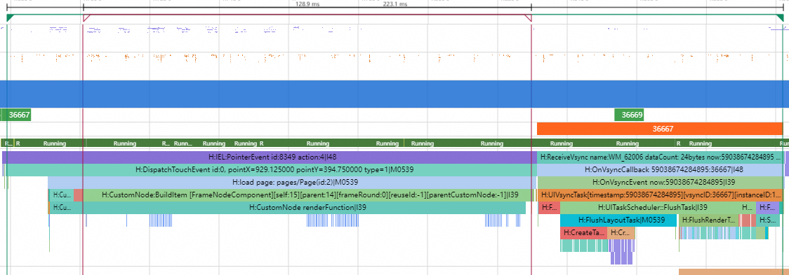
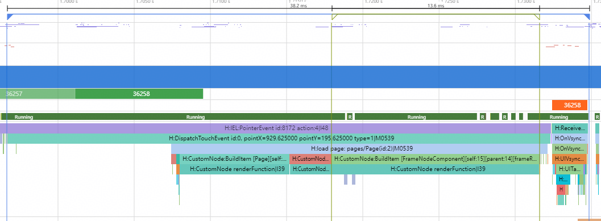

# 使用FrameNode多线程接口创建UI组件

### 介绍

本示例介绍如何使用FrameNode多线程接口在非UI线程创建UI组件，从而优化组件创建耗时和响应时延。

### 效果图预览


**使用说明**

1. 点击CreatePageOnMultiThread按钮，多线程创建UI页面；
2. 点击CreatePageOnUIThread按钮，在UI线程创建UI页面作为对比。

### 实现思路

点击CreatePageOnMultiThread按钮，跳转到并行创建的UI页面，页面内的UI组件使用子线程并行创建。

1. FrameNodeComponent自定义组件用于挂载通过ArkTS FrameNode相关接口创建的组件树。源码参考[Page.ets](./entry/src/main/ets/pages/Page.ets)，根据isOnUIThread的状态分别调用NodeUtils.createNodeTreeOnUIThread在UI线程创建组件和NodeUtils.createNodeTreeOnMultiThread在多线程创建组件。

```typescript
'use static'

import {
  Entry, Text, Column, Component, Button, ClickEvent, ContentSlot, Alignment, TextAlign, FontWeight, Flex
} from '@kit.ArkUI';
import { State, Link } from '@ohos.arkui.stateManagement';
import hilog from '@ohos.hilog';
import { NodeUtils } from '../node/NodeUtils';
import { NodeContent, FrameNode } from '@ohos.arkui.node';
import { RouterInfo } from '../models/RouterInfo';

@Component
struct FrameNodeComponent {
  private rootSlot: NodeContent = new NodeContent();
  @State isOnUIThread: boolean = false;

  aboutToAppear(): void {
    if (this.isOnUIThread) {
      // 在UI线程创建组件
      NodeUtils.createNodeTreeOnUIThread(this.rootSlot, this.getUIContext());
    } else {
      // 多线程创建组件
      NodeUtils.createNodeTreeOnMultiThread(this.rootSlot, this.getUIContext());
    }
  }

  aboutToDisappear(): void {
    // 释放已创建的FrameNode节点
    NodeUtils.disposeNodeTree(this.rootSlot);
  }

  build() {
    Column() {
      // FrameNode节点挂载点
      ContentSlot(this.rootSlot)
    }
    .width('100%')
  }
}
```

2. createNodeTreeOnMultiThread接口会最终调用createCardNodeTreeOnMultiThread接口在多线程创建UI组件。示例中把页面中的每个卡片拆分为一个子任务，调用EAWorker.postTask接口在非UI线程创建卡片对应的UI组件树。源码参考[NodeUtils.ets](./entry/src/main/ets/node/NodeUtils.ets)。

```typescript
function createCardNodeTreeOnMultiThread(context: UIContext, cardInfo: CardInfo, parent: FrameNode,
  workerSet: Set<EAWorker>): void {
  const worker = new EAWorker();
  workerSet.add(worker);
  worker.start();
  worker.postTask(() => {
    let child: FrameNode | null = null;
    if (cardInfo.type === 'App') {
      child = createAppCard(context, cardInfo.appCardInfo!, true);
    } else if (cardInfo.type === 'Service') {
      child = createServiceCard(context, cardInfo.serviceCardInfo!, true);
    }
    EAWorker.main().postTask(() => {
      parent.appendChild(child!);
    });
  });
}
```

3. 根据卡片类型会分别在非UI线程调用createAppCard和createServiceCard，创建对应的UI组件树并设置属性。源码参考[NodeUtils.ets](./entry/src/main/ets/node/NodeUtils.ets)。

```typescript
function createAppCard(context: UIContext, appCardInfo: AppCardInfo, supportMultiThread: boolean = false): FrameNode {
  const columnNode = typeNode.createColumnNode(context, { supportMultiThread: supportMultiThread });
  columnNode.initialize()
    .height('40%')
    .width('95%')
    .backgroundColor('#ffffffff')
    .borderRadius(10)
    .padding(5);

  const titleTextNode = typeNode.createTextNode(context, { supportMultiThread: supportMultiThread });
  titleTextNode.initialize(appCardInfo.name).width('90%').height('10%').fontSize(16);
  columnNode.appendChild(titleTextNode);

  const homeGridNode = typeNode.createGridNode(context, { supportMultiThread: supportMultiThread });
  homeGridNode.initialize()
    .width('100%')
    .height('90%')
    .columnsTemplate('1fr 1fr 1fr 1fr 1fr')
    .columnsGap(3.0)
    .rowsGap(0);
  columnNode.appendChild(homeGridNode);

  for (let itemsElement of appCardInfo.items) {
    const appItemNode = typeNode.createGridItemNode(context, { supportMultiThread: supportMultiThread });
    appItemNode.initialize().width('20%').height('24%');
    homeGridNode.appendChild(appItemNode);
    appItemNode.appendChild(createAppItem(context, itemsElement, supportMultiThread));
  }
  return columnNode;
}

function createServiceCard(context: UIContext, serviceCardInfo: ServiceCardInfo,
  supportMultiThread: boolean = false): FrameNode {
  const columnNode = typeNode.createColumnNode(context, { supportMultiThread: supportMultiThread });
  columnNode.initialize()
    .width('95%')
    .height('20%')
    .backgroundColor('#ffffffff')
    .borderRadius(10)
    .padding({
      top: 5,
      right: 5,
      bottom: 5,
      left: 5
    });

  const titleTextNode = typeNode.createTextNode(context, { supportMultiThread: supportMultiThread });
  titleTextNode.initialize(serviceCardInfo.name).width('90%').height('10%').fontSize(16);
  columnNode.appendChild(titleTextNode);

  const scrollNode = typeNode.createScrollNode(context, { supportMultiThread: supportMultiThread });
  scrollNode.initialize()
    .width('100%')
    .height('90%')
    .scrollable(ScrollDirection.Horizontal)
    .scrollBar(BarState.Off);
  columnNode.appendChild(scrollNode);

  const rowNode = typeNode.createRowNode(context, { supportMultiThread: supportMultiThread });
  scrollNode.appendChild(rowNode);
  for (let serviceItem of serviceCardInfo.items) {
    rowNode.appendChild(createServiceItem(context, serviceItem, supportMultiThread));
  }
  return columnNode;
}
```

4. createAppCard和createServiceCard执行完成后，会在UI线程被调用appendChild，将子线程创建好的UI组件树挂载到UI主树上，使其可以在页面上显示出来。源码参考[NodeCreator.cpp](./entry/src/main/cpp/node/NodeCreator.cpp)

```cpp
EAWorker.main().postTask(() => {
  parent.appendChild(child!);
});
```

### 性能对比

本示例使用了FrameNode多线程接口在非UI线程创建UI组件，减少了UI线程组件创建耗时，优化了页面跳转响应时延。

参考[使用SmartPerf-Host分析应用性能](https://docs.openharmony.cn/pages/v6.0/zh-cn/application-dev/performance/performance-optimization-using-smartperf-host.md)文档，抓取trace对比分别使用并行创建和串行创建建组件时的性能。

- 使用UI线程创建UI组件



- 使用多线程创建UI组件



trace中BuildItem[FrameNodeComponent]段的耗时为UI线程组件创建的耗时；响应时延通常以多模输入事件为起点，在本案例中对应于页面点击事件中的抬手时刻，结束点则为UI线程提交首帧绘制命令并完成上屏的时刻。基于上述分析生成如下性能对比表格。

|                    | 多线程创建 | UI线程创建 | 优化比例 |
| -------- | -------- | -------- | -------- |
| UI线程组件创建耗时 | 13.6ms     | 128.9ms   | 89.4%    |
| 响应时延           | 38.2ms     | 223.1ms   | 82.8%    |

### 工程结构&模块类型  

    ```
    |entry/src/main/ets
    |   |---data
    |   |   |---MockData.ets                            // UI卡片内容模拟数据
    |   |---entryablity
    |   |   |---EntryAbility.ets                         // 程序入口类
    |   |---models
    |   |   |---CardInfo.ets                            // UI卡片数据结构定义
    |   |   |---RouterInfo.ets                          // 路由信息数据结构定义
    |   |---node
    |   |   |---NodeUtils.ets                           // UI组件树创建实现
    |   |---pages
    |   |   |---Index.ets                               // 首页
    |   |   |---Page.ets                                // 组件页面
    ```

### 参考资料

[自定义组件节点 (FrameNode)](https://docs.openharmony.cn/pages/v6.0/zh-cn/application-dev/ui/arkts-user-defined-arktsNode-frameNode.md)

[使用SmartPerf-Host分析应用性能](https://docs.openharmony.cn/pages/v6.0/zh-cn/application-dev/performance/performance-optimization-using-smartperf-host.md)

### 相关权限

不涉及。

### 依赖

不涉及。

### 约束与限制

1.本示例仅支持标准系统上运行。

2.本示例为Stage模型，支持API20版本SDK，SDK版本号（API Version 20 Release）。

3.本示例需要使用DevEco Studio版本号（DevEco Studio 5.0.0 Release）及以上版本才可编译运行。

### 下载

如需单独下载本工程，执行如下命令：

```shell
git init
git config core.sparsecheckout true
echo code/ArkTS-Sta/FrameNodeBuildOnMultiThread/ > .git/info/sparse-checkout
git remote add origin https://gitcode.com/openharmony/applications_app_samples.git
git pull origin master