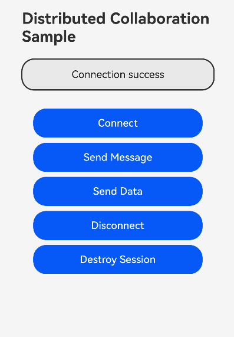

# ArkTS静态模式分布式协作示例

### 介绍

本示例展示了ArkTS 1.2静态模式下，如何使用分布式设备管理能力实现跨设备协作。通过AbilityConnectionManager接口，实现设备间的连接、消息和数据传输功能。

### 效果预览

| 分布式协作示例 |
|---|
|  |
| 本示例需要两台设备配合测试，展示设备间的连接、消息传递、数据传输等功能。 |

### 使用说明

1. 准备两台HarmonyOS设备，登录同一华为账号
2. 在两台设备上分别安装本示例应用
3. 打开应用后，点击"Connect"按钮连接远程设备
4. 连接成功后，可以使用"Send Message"发送文本消息
5. 使用"Send Data"发送二进制数据
6. 测试完成后，点击"Disconnect"断开连接，或"Destroy Session"销毁会话

### 工程目录

```
entry/src/main/ets/
├── entryability
│   └── EntryAbility.ets         // 应用入口
└── pages
    └── Index.ets                // 主页面，实现分布式协作功能
```

### 具体实现

* 设备连接：使用 `abilityConnectionManager.createAbilityConnectionSession` 创建会话，源码参考：[Index.ets](entry/src/main/ets/pages/Index.ets)
* 消息发送：使用 `abilityConnectionManager.sendMessage` 发送文本消息，源码参考：[Index.ets](entry/src/main/ets/pages/Index.ets)
* 数据传输：使用 `abilityConnectionManager.sendData` 发送二进制数据，源码参考：[Index.ets](entry/src/main/ets/pages/Index.ets)
* 事件监听：注册连接、断开、消息接收等事件回调，源码参考：[Index.ets](entry/src/main/ets/pages/Index.ets)

### 相关权限

本示例需要以下权限：

* `ohos.permission.CAMERA` - 相机权限
* `ohos.permission.MICROPHONE` - 麦克风权限
* `ohos.permission.READ_MEDIA` - 读取媒体权限
* `ohos.permission.WRITE_MEDIA` - 写入媒体权限
* `ohos.permission.DISTRIBUTED_DATASYNC` - 分布式数据同步权限

### 依赖

无

### 约束与限制

1. 本示例仅支持标准系统上运行，支持设备：Phone、Tablet
2. 本示例为Stage模型，支持API23版本SDK，SDK版本号(API Version 23)
3. 本示例需要使用DevEco Studio版本号(6.1.0.200)及以上版本才可编译运行
4. 本示例使用ArkTS 1.2静态模式编译
5. 需要两台设备登录同一华为账号才能进行分布式协作测试

### 下载

如需单独下载本工程，执行如下命令：

```
git init
git config core.sparsecheckout true
echo code/ArkTS-Sta/StaticCollabSample/ > .git/info/sparse-checkout
git remote add origin https://gitcode.com/openharmony/applications_app_samples.git
git pull origin master
```
