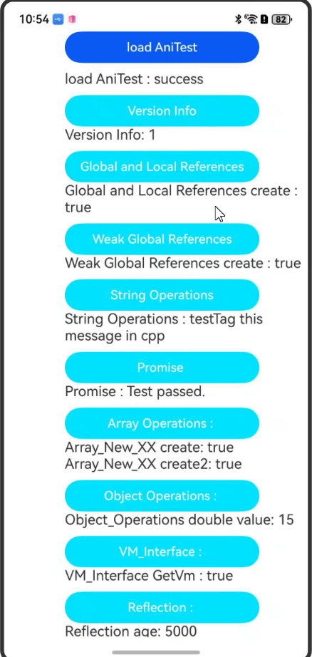
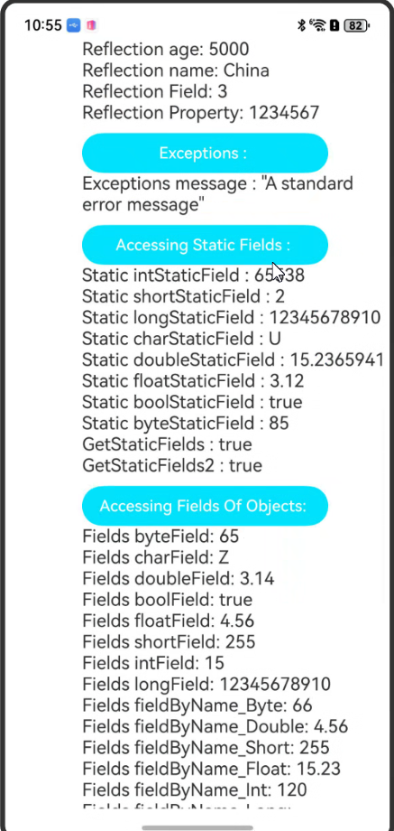
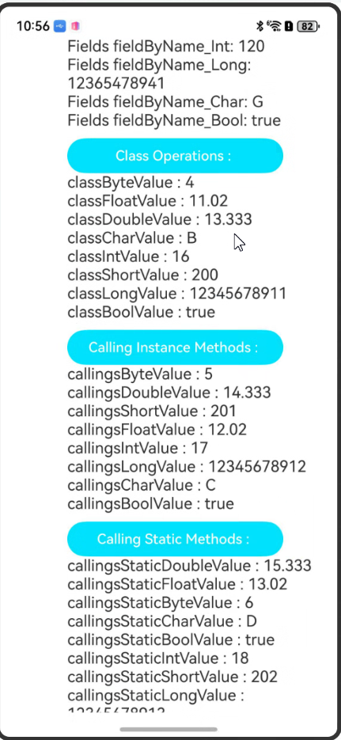

# ArkTs和C++互相调用

### 介绍

如下需求和场景的相互调用：ArkTS 2.0原生接口（类型API）ArkTS 2.0原生接口（对象API）ArkTS 2.0原生接口（VM API）

### 效果预览

效果如下所示：

|主页|主页|主页|
|--------------------------------|---------------------------------|--------------------------------|
||||

使用说明

1. 在主界面，优先点击蓝色按钮'loadAniTest'加载ani动态库；
2. 依次点击其余按钮会在对应下方预期结果部分打印出对应日志；


### 工程目录

```
entry/src/main
|---cpp
|   |---ani_accessing_fields.cpp               // 成员属性/静态成员案例
|   |---ani_array.cpp                          // 数组案例
|   |---ani_calling_methods.cpp                // 方法回调/静态方法案例
|   |---ani_class_operation.cpp                // 类案例
|   |---ani_error.cpp                          // 异常机制案例
|   |---ani_init.cpp                           // ani方法绑定
|   |---ani_object.cpp                         // 对象案例
|   |---ani_promise.cpp                        // 异步案例
|   |---ani_references.cpp                     // 全局/局部/弱引用创建案例
|   |---ani_reflection.cpp                     // 反射机制
|   |---ani_string.cpp                         // 字符串案例
|   |---ani_versionInfo.cpp                    // 版本信息
|   |---ani_vminterface.cpp                    // 虚接口案例
|   |---CMakeLists.txt
|---ets
|   |---pages
|   |   |---index.ets                          // 首页
```

### 具体实现

* VM Interface 源码参考: [ani_vminterface.cpp](entry/src/main/cpp/ani_vminterface.cpp)
    * 调用[VMInterface()](entry/src/main/cpp/ani_vminterface.cpp)函数检索虚拟机（VM）实例。
* Version Info 源码参考: [ani_versionInfo.cpp](entry/src/main/cpp/ani_versionInfo.cpp)
    * 调用[GetVersionInfo()](entry/src/main/cpp/ani_versionInfo.cpp)函数获取版本信息。
* Global and Local References 源码参考: [ani_references.cpp](entry/src/main/cpp/ani_references.cpp)
    * 调用[Global_Local_References()](entry/src/main/cpp/ani_references.cpp)函数创建一个全局引用，成功创建后销毁。
* Weak Global References 源码参考: [ani_references.cpp](entry/src/main/cpp/ani_references.cpp)
    * 调用[Weak_Global_References()](entry/src/main/cpp/ani_references.cpp)函数创建一个弱引用，成功创建后销毁。
* String Operations 源码参考: [ani_string.cpp](entry/src/main/cpp/ani_string.cpp)
    * 调用[String_Operations()](entry/src/main/cpp/ani_string.cpp)函数将字符串返回到ArkTS。
* Promise 源码参考: [ani_promise.cpp](entry/src/main/cpp/ani_promise.cpp)
    * 调用[startAbility()](entry/src/main/cpp/ani_promise.cpp)函数异步调用日志会打印线程ID，同时返回指定数字判断是否为预定数字，相同则测试通过，否则返回失败。
* Array Operations 源码参考: [ani_array.cpp](entry/src/main/cpp/ani_array.cpp)
    * 调用[ProcessArray()](entry/src/main/cpp/ani_array.cpp)函数创建基础数据并返回创建是否成功的布尔值到ArkTS。
    * 调用[ProcessArray2()](entry/src/main/cpp/ani_array.cpp)函数创建剩余基础数据并返回创建是否成功的布尔值到ArkTS。
* Object Operations 源码参考: [ani_object.cpp](entry/src/main/cpp/ani_object.cpp)
    * 调用[HandleDoubleData()](entry/src/main/cpp/ani_object.cpp)函数创建ani_object对象将传入数据绑定到该对象上，检查对象是否是指定类型的实例，同时返回传入的值。
* Exceptions 源码参考: [ani_error.cpp](entry/src/main/cpp/ani_error.cpp)
    * 调用[ThrowError()](entry/src/main/cpp/ani_error.cpp)函数抛出ArkTs创建的错误类信息。
* Reflection Support 源码参考: [ani_reflection.cpp](entry/src/main/cpp/ani_reflection.cpp)
    * 调用[CreatePerson()](entry/src/main/cpp/ani_reflection.cpp)函数创建ArkTs侧对象同时调用Object_SetPropertyByName_Int()和Object_SetPropertyByName_Ref()对继承的接口成员属性赋值并返回。
    * 调用[BindSet()](entry/src/main/cpp/ani_reflection.cpp)函数对ArkTs侧成员变量赋值。
    * 调用[BindGet()](entry/src/main/cpp/ani_reflection.cpp)函数获取ArkTs侧成员变量并返回。
* Accessing Static Fields 源码参考: [ani_accessing_fields.cpp](entry/src/main/cpp/ani_accessing_fields.cpp) 
    * 调用[UpdateStaticFields()](entry/src/main/cpp/ani_accessing_fields.cpp)函数调用ArkTs侧静态成员变量并从C++侧赋值。
    * 调用[UpdateStaticFields2()](entry/src/main/cpp/ani_accessing_fields.cpp)函数调用ArkTs侧静态成员变量并从C++侧赋值。
    * 调用[GetStaticFields()](entry/src/main/cpp/ani_accessing_fields.cpp)函数可从ArkTS类中获取静态成员的值。
    * 调用[GetStaticFields2()](entry/src/main/cpp/ani_accessing_fields.cpp)函数可从ArkTS类中获取静态成员的值。
* Accessing Fields Of Objects 源码参考: [ani_accessing_fields.cpp](entry/src/main/cpp/ani_accessing_fields.cpp)
    * 调用[UpdateFields()](entry/src/main/cpp/ani_accessing_fields.cpp)函数调用ArkTs侧通过类名并且查询成员名称字段后，调用ani方法Object_SetField_XX()从C++侧赋值。
    * 调用[UpdateField2()](entry/src/main/cpp/ani_accessing_fields.cpp)函数调用ArkTs侧通过类名并且查询成员名称字段后，调用ani方法Object_SetField_XX()从C++侧赋值。
    * 调用[UpdateByNameFields()](entry/src/main/cpp/ani_accessing_fields.cpp)函数调用ArkTs侧通过查找成员变量名称直接从C++侧赋值。
    * 调用[UpdateByNameFields2()](entry/src/main/cpp/ani_accessing_fields.cpp)函数调用ArkTs侧通过查找成员变量名称直接从C++侧赋值。
* Class Operations  源码参考: [ani_class_operation.cpp](entry/src/main/cpp/ani_class_operation.cpp)
    * 调用[NativeVoidFunc()](entry/src/main/cpp/ani_class_operation.cpp)函数中先通过FindClass()寻找ArkTs的类，调用Class_FindMethod()通过方法的名称和签名查找方法,使用Object_CallMethod_Void()方法回调触发ArkTs的另一函数并不带返回值。
    * 调用[NativeBoolFunc()](entry/src/main/cpp/ani_class_operation.cpp)函数中先通过FindClass()寻找ArkTs的类，调用Class_FindMethod()通过方法的名称和签名查找方法,然后使用Object_CallMethod_Boolean()方法回调触发ArkTs的另一函数并带返回值，返回值类型为boolean，将返回值返回给ani的绑定函数。
    * 调用[NativeIntFunc()](entry/src/main/cpp/ani_class_operation.cpp)函数中使用Object_CallMethod_Int()方法回调触发ArkTs的另一函数并带返回值，返回值类型为int，将返回值返回给ani的绑定函数。
    * 调用[NativeShortFunc()](entry/src/main/cpp/ani_class_operation.cpp)函数中先通过FindClass()寻找ArkTs的类，调用Class_FindMethod()通过方法的名称和签名查找方法,使用Object_CallMethod_Short()方法回调触发ArkTs的另一函数并带返回值，返回值类型为short，将返回值返回给ani的绑定函数。
    * 调用[NativeLongFunc()](entry/src/main/cpp/ani_class_operation.cpp)函数中先通过FindClass()寻找ArkTs的类，调用Class_FindMethod()通过方法的名称和签名查找方法,使用Object_CallMethod_Long()方法回调触发ArkTs的另一函数并带返回值，返回值类型为long，将返回值返回给ani的绑定函数。
    * 调用[NativeDoubleFunc()](entry/src/main/cpp/ani_class_operation.cpp)函数中先通过FindClass()寻找ArkTs的类，调用Class_FindMethod()通过方法的名称和签名查找方法,使用Object_CallMethod_Double()方法回调触发ArkTs的另一函数并带返回值，返回值类型为double，将返回值返回给ani的绑定函数。
    * 调用[NativeFloatFunc()](entry/src/main/cpp/ani_class_operation.cpp)函数中先通过FindClass()寻找ArkTs的类，调用Class_FindMethod()通过方法的名称和签名查找方法,使用Object_CallMethod_Float()方法回调触发ArkTs的另一函数并带返回值，返回值类型为float，将返回值返回给ani的绑定函数。
    * 调用[NativeCharFunc()](entry/src/main/cpp/ani_class_operation.cpp)函数中先通过FindClass()寻找ArkTs的类，调用Class_FindMethod()通过方法的名称和签名查找方法,使用Object_CallMethod_Char()方法回调触发ArkTs的另一函数并带返回值，返回值类型为char，将返回值返回给ani的绑定函数。
    * 调用[NativeByteFunc()](entry/src/main/cpp/ani_class_operation.cpp)函数中先通过FindClass()寻找ArkTs的类，调用Class_FindMethod()通过方法的名称和签名查找方法,使用Object_CallMethod_Byte()方法回调触发ArkTs的另一函数并带返回值，返回值类型为byte，将返回值返回给ani的绑定函数。
* Calling Instance Methods 源码参考: [ani_calling_methods.cpp](entry/src/main/cpp/ani_calling_methods.cpp)
    * 调用[NativeByNameFunc()](entry/src/main/cpp/ani_calling_methods.cpp)函数中直接使用Object_CallMethodByName_Void()方法回调触发ArkTs的另一函数不带返回值。
    * 调用[NativeByNameDoubleFunc()](entry/src/main/cpp/ani_calling_methods.cpp)函数中直接使用Object_CallMethodByName_Double()方法回调触发ArkTs的另一函数带返回值，返回值类型为double，将返回值返回给ani的绑定函数。
    * 调用[NativeByNameBoolFunc()](entry/src/main/cpp/ani_calling_methods.cpp)函数中直接使用Object_CallMethodByName_Boolean()方法回调触发ArkTs的另一函数带返回值，返回值类型为boolean，将返回值返回给ani的绑定函数。
    * 调用[NativeByNameIntFunc()](entry/src/main/cpp/ani_calling_methods.cpp)函数中直接使用Object_CallMethodByName_Int()方法回调触发ArkTs的另一函数带返回值，返回值类型为int，将返回值返回给ani的绑定函数。
    * 调用[NativeByNameShortFunc()](entry/src/main/cpp/ani_calling_methods.cpp)函数中直接使用Object_CallMethodByName_Short()方法回调触发ArkTs的另一函数带返回值，返回值类型为short，将返回值返回给ani的绑定函数。
    * 调用[NativeByNameLongFunc()](entry/src/main/cpp/ani_calling_methods.cpp)函数中直接使用Object_CallMethodByName_Long()方法回调触发ArkTs的另一函数带返回值，返回值类型为long，将返回值返回给ani的绑定函数。
    * 调用[NativeByNameCharFunc()](entry/src/main/cpp/ani_calling_methods.cpp)函数中直接使用Object_CallMethodByName_Char()方法回调触发ArkTs的另一函数带返回值，返回值类型为char，将返回值返回给ani的绑定函数。
    * 调用[NativeByNameFloatFunc()](entry/src/main/cpp/ani_calling_methods.cpp)函数中直接使用Object_CallMethodByName_Boolean()方法回调触发ArkTs的另一函数带返回值，返回值类型为float，将返回值返回给ani的绑定函数。
    * 调用[NativeByNameByteFunc()](entry/src/main/cpp/ani_calling_methods.cpp)函数中直接使用Object_CallMethodByName_Byte()方法回调触发ArkTs的另一函数带返回值，返回值类型为byte，将返回值返回给ani的绑定函数。
* Calling Static Methods 源码参考: [ani_calling_methods.cpp](entry/src/main/cpp/ani_calling_methods.cpp)
    * 调用[NativeStaticFunc()](entry/src/main/cpp/ani_calling_methods.cpp)函数中先通过FindClass()寻找ArkTs的类，调用Class_FindStaticMethod()通过方法的名称和签名查找静态方法,使用Class_CallStaticMethod_Void()方法回调触发ArkTs的另一函数不带返回值。
    * 调用[NativeStaticFuncDouble()](entry/src/main/cpp/ani_calling_methods.cpp)函数中先通过FindClass()寻找ArkTs的类，调用Class_FindStaticMethod()通过方法的名称和签名查找静态方法,使用Class_CallStaticMethod_Double()方法回调触发ArkTs的另一函数带返回值，返回值类型为double，将返回值返回给ani的绑定函数。
    * 调用[NativeStaticFuncFloat()](entry/src/main/cpp/ani_calling_methods.cpp)函数中先通过FindClass()寻找ArkTs的类，调用Class_FindStaticMethod()通过方法的名称和签名查找静态方法,使用Class_CallStaticMethod_Float()方法回调触发ArkTs的另一函数带返回值，返回值类型为float，将返回值返回给ani的绑定函数。
    * 调用[NativeStaticFuncChar()](entry/src/main/cpp/ani_calling_methods.cpp)函数中先通过FindClass()寻找ArkTs的类，调用Class_FindStaticMethod()通过方法的名称和签名查找静态方法,使用Class_CallStaticMethod_Char()方法回调触发ArkTs的另一函数带返回值，返回值类型为char，将返回值返回给ani的绑定函数。
    * 调用[NativeStaticFuncByte()](entry/src/main/cpp/ani_calling_methods.cpp)函数中先通过FindClass()寻找ArkTs的类，调用Class_FindStaticMethod()通过方法的名称和签名查找静态方法,使用Class_CallStaticMethod_Byte()方法回调触发ArkTs的另一函数带返回值，返回值类型为byte，将返回值返回给ani的绑定函数。
    * 调用[NativeStaticFuncBoolean()](entry/src/main/cpp/ani_calling_methods.cpp)函数中先通过FindClass()寻找ArkTs的类，调用Class_FindStaticMethod()通过方法的名称和签名查找静态方法,使用Class_CallStaticMethod_Boolean()方法回调触发ArkTs的另一函数带返回值，返回值类型为boolean，将返回值返回给ani的绑定函数。
    * 调用[NativeStaticFuncInt()](entry/src/main/cpp/ani_calling_methods.cpp)函数中先通过FindClass()寻找ArkTs的类，调用Class_FindStaticMethod()通过方法的名称和签名查找静态方法,使用Class_CallStaticMethod_Int()方法回调触发ArkTs的另一函数带返回值，返回值类型为int，将返回值返回给ani的绑定函数。
    * 调用[NativeStaticFuncShort()](entry/src/main/cpp/ani_calling_methods.cpp)函数中先通过FindClass()寻找ArkTs的类，调用Class_FindStaticMethod()通过方法的名称和签名查找静态方法,使用Class_CallStaticMethod_Short()方法回调触发ArkTs的另一函数带返回值，返回值类型为short，将返回值返回给ani的绑定函数。
    * 调用[NativeStaticFuncLong()](entry/src/main/cpp/ani_calling_methods.cpp)函数中先通过FindClass()寻找ArkTs的类，调用Class_FindStaticMethod()通过方法的名称和签名查找静态方法,使用Class_CallStaticMethod_Long()方法回调触发ArkTs的另一函数带返回值，返回值类型为long，将返回值返回给ani的绑定函数。
 * Promise 源码参考: [ani_promise.cpp](entry/src/main/cpp/ani_promise.cpp)
 ### 相关权限

无

### 依赖

无

### 约束与限制

1. 本示例仅支持标准系统上运行，支持设备：Phone;
2. 本示例为Stage模型，支持API20版本SDK，SDK版本号(API Version 20),镜像版本号(6.0.0.31)。
3. 本示例需要使用DevEco Studio 版本号(6.0.0.6)版本才可编译运行。

### 下载

如需单独下载本工程，执行如下命令：

```
git init
git config core.sparsecheckout true
echo code/ArkTS1.2/ANISample/ > .git/info/sparse-checkout
git remote add origin https://gitee.com/openharmony/applications_app_samples.git
git pull
```