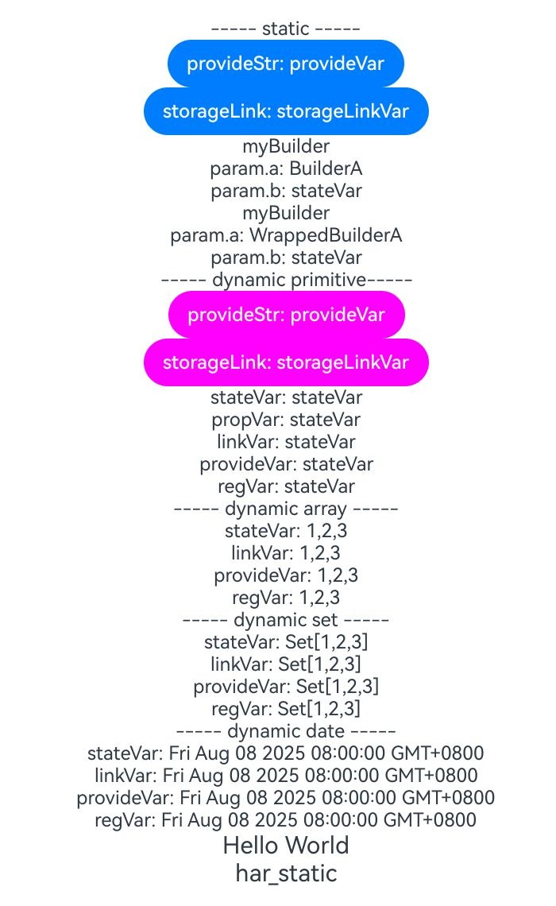

# 组件复用示例

### 介绍

1.主要通过1.2工程调用1.1har包，1.1har包再去引用1.2har包的方式，来验证互操作场景下数据能否正常在页面显示。

### 效果预览

效果如下所示：

|互操作har包装饰器实现数据传递实现案例|
|--------------------------------|
||

使用说明

1. 在主界面，点击蓝色按钮"provideStr：provideVar"以及"storageLink:storageVar"。
    * 下面粉色按钮中的数据会随之改变。(其他)
2.  在主界面，点击粉色按钮"provideStr：provideVar",蓝色按钮的数据会变为最初，点击粉色按钮"storageLink:storageVar",蓝色按钮的数据也会同步增加。
    * 蓝色按钮(provideStr：provideVar)的数据会变为最初，蓝色按钮(storageLink:storageVar)的数据也会同步增加。

### 工程目录

```
entry/src/main/ets/
|---pages
|   |---index.ets  //首页
|   |
har_dynamic/src/ets/
|---componenets
|   |---MainPage.ets  //1.1页面组件
|   |   
har_static/src/ets/
|---componenets
|   |---MainPage.ets  //1.2页面组件
|   |                   
```

### 具体实现

* 1.2调用1.1: [index](entry/src/main/ets/pages/Index.ets)
    * 使用child子组件来将引入的har_dyanmic(1.1har包)的组件展示初始化，在child使用link来初始化数据
    * 在index页面Parent父组件将数据初始化并传递给Child子组件完成数据展示
* 1.1har包 har_dynamic包 源码参考: [MainPage](har_dynamic/src/main/ets/components/MainPage.ets)
* 1.2har包 harStatic包 源码参考: [MainPage](har_static/src/main/ets/components/MainPage.ets)
    * (1.1har包)将不同类型的数据class、Set、Map、Date做成组件，然后在har_dynamic下面的index里导出
    * (1.2har包)写了一个基础页面不包含装饰器，然后在har_static下面的index里导出

### 相关权限

无

### 依赖

无

### 约束与限制

1. 本示例仅支持标准系统上运行，支持设备：Phone;
2. 本示例为Stage模型，支持API20版本SDK，SDK版本号(API Version 20),镜像版本号(5.0.1.5)。
3. 本示例需要使用DevEco Studio 版本号(6.0.0.6)版本才可编译运行。

### 下载

如需单独下载本工程，执行如下命令：

```
git init
git config core.sparsecheckout true
echo code/ArkTS1.2/ArkUIInteropSample/ > .git/info/sparse-checkout
git remote add origin https://gitcode.com/openharmony/applications_app_samples.git
git pull
```