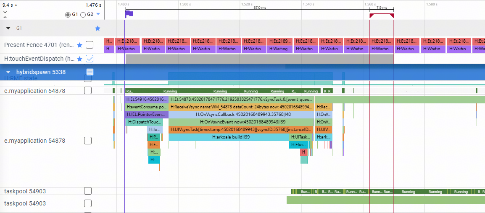
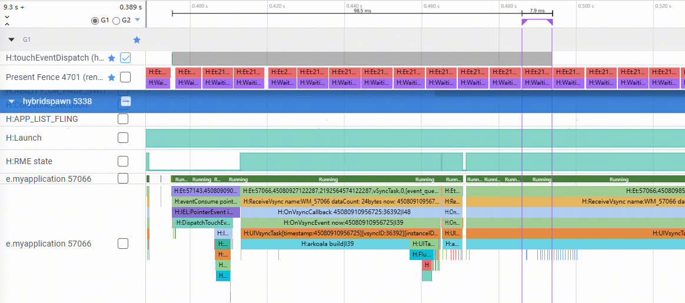
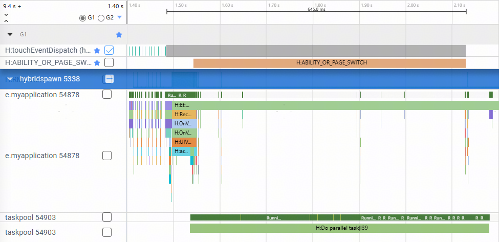
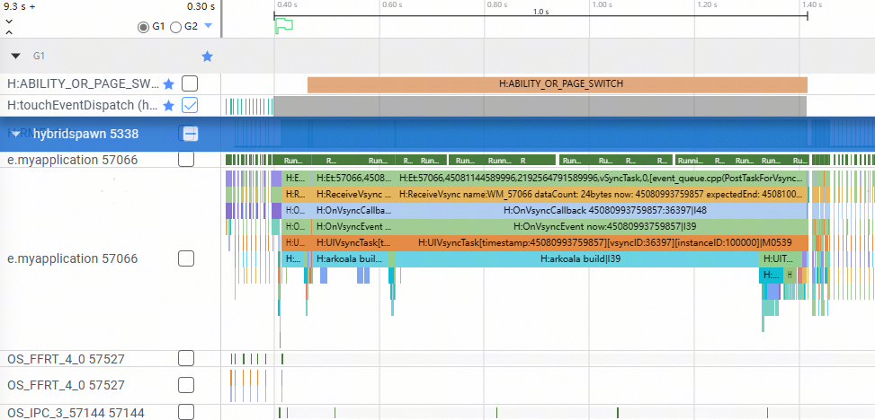

# BuilderNode并行化构建节点树

### 介绍

本示例介绍了BuilderNode并行化构建节点树，从而显著提升页面渲染性能与交互流畅度。

### 效果图预览


**使用说明**

1. 使用BuilderNode开发一个桌面应用文件夹UI（图标网格）。
2. 提供两种创建方式，分别是BuilderNode非并行创建和BuilderNode并行创建。
3. 对比了BuilderNode非并行创建和并行创建的性能差异。

### 实现思路

1. 初始界面：提供"非并行"和"并行"两个构建模式选项，点击后展示对应模式下创建的应用图标网格。源码参考[Index.ets](./entry/src/main/ets/pages/Index.ets)。
    ```ts
    @Entry
    @Component
    struct Index {
      // 页面状态
      @State flag: boolean = false;   // 是否已进入功能界面
      @State mode: string = '';       // 当前选择的模式
      uiContext?: UIContext           // 保存 UIContext 用于并行节点创建

      // 页面即将显示时调用
      aboutToAppear() {
        this.uiContext = this.getUIContext()
      }

      build() {
        Stack() {
          // 背景图
          Image($r("app.media.bg"))
            .height('100%')
            .width('100%')

          // 判断是否已选择模式
          if (!this.flag) {
            // 选择模式界面
            Grid() {
              // 非并行模式按钮
              GridItem() {
                Column() {
                  SmallFolder()
                  Text("非并行")
                }
              }
              .onClick((event: ClickEvent) => {
                this.flag = true
                this.mode = "非并行"
              })

              // 并行模式按钮
              GridItem() {
                Column() {
                  SmallFolder()
                  Text("并行")
                }
              }
              .onClick((event: ClickEvent) => {
                this.flag = true
                this.mode = "并行"
                hilog.info(0x0000, 'testTag', `onClick`);
                // 并行模式下创建节点
                createNode(iconDatas, this.uiContext!)
              })
            }
            .margin({ top: 10 } as Padding)
            .columnsGap(0)
            .rowsGap(10)
            .columnsTemplate('1fr 1fr')
            .rowsTemplate('1fr 1fr')
            .width(340)
            .height(660)
          } else {
            // 已选择模式后的展示界面
            Stack() {
              // 显示当前模式提示
              Column() {
                Text(`创建模式: ${this.mode}`)
                  .fontSize(20)
                  .fontColor(Color.Red)
              }
              .borderRadius(15)
              .height(400)
              .width(240)
              .backgroundColor(Color.Gray)
              .opacity(0.3)
              .margin({ top: 60 } as Padding)

              // 显示已创建的节点
              Grid() {
                ForEach(iconDatas, (item: IconData, index: Int) => {
                  GridItem() {
                    NodeContainer(getNode(index, item))
                  }
                })
              }
              .width(240)
              .height(400)
              .margin({ top: 100 } as Padding)
              .columnsTemplate('1fr 1fr 1fr')
              .rowsTemplate('1fr 1fr 1fr 1fr')
            }.height(600)
          }
        }
      }
    }
    ```
    

2. 点击并行文件夹，createNode并行创建，提前为每个IconData构建BuilderNode，BuilderNode的build方法指定useParallel为true说明是并行构建UI节点。源码参考[Index.ets](./entry/src/main/ets/pages/Index.ets)。

    ```ts
    // 点击并行文件夹，createNode并行创建
    GridItem() {
      Column() {
        SmallFolder()
        Text("并行")
      }
    }
    .onClick((event: ClickEvent) => {
      this.flag = true
      this.mode = "并行"
      hilog.info(0x0000, 'testTag', `onClick`);
      createNode(iconDatas, this.uiContext!)
    })

    // 提前为每个IconData构建BuilderNode，BuilderNode的build方法指定useParallel为true说明是并行构建UI节点。
    function createNode(items: Array<IconData>, uiContext: UIContext) {
      for (let i = 0; i < items.length; i++) {
        hilog.info(0x0000, 'testTag', `createNode ${JSON.stringify(items[i])}}`);
        let builderNode = new BuilderNode<IconData>(uiContext);
        builderNode.build(wrapBuilder(AppIcon), items[i], { useParallel: true });
        builderNodes.push(builderNode)
      }
    }
    ```
    

3. 点击非并行文件夹，createNode并行创建，提前为每个IconData构建BuilderNode，BuilderNode的build方法指定useParallel为true说明是并行构建UI节点。源码参考[Index.ets](./entry/src/main/ets/pages/Index.ets)。

    ```ts
    // 点击非并行文件夹，createNode并行创建
    GridItem() {
      Column() {
        SmallFolder()
        Text("非并行")
      }
    }
    .onClick((event: ClickEvent) => {
      this.flag = true
      this.mode = "非并行"
    })

    // getNode函数根据索引返回对应的MyNodeController实例。build方法没有指定useParallel为true，表示是非并行构建UI节点。
    function getNode(index: number, param: IconData) {
      hilog.info(0x0000, 'testTag', `getNode length = ${builderNodes.length} index = ${index}`);
      if (builderNodes.length < index + 1) {
        hilog.info(0x0000, 'testTag', `getNode 1`);
        return new MyNodeController(param)
      }
      return new MyNodeController(undefined, builderNodes[index as Int]);
    }

    // MyNodeController用来控制UI节点的生成。
    class MyNodeController extends NodeController {
      private builderNode ?: BuilderNode<IconData>;
      private uiContext?: UIContext;
      private params?: IconData;

      constructor(params?: IconData, builderNode ?: BuilderNode<IconData>) {
        this.params = params;
        this.builderNode = builderNode;
      }
      // 创建节点
      makeNode(uiContext: UIContext): FrameNode | null {
        this.uiContext = uiContext;
        if (this.builderNode == undefined) {
          this.builderNode = new BuilderNode<IconData>(this.uiContext!);
          this.builderNode!.build(wrapBuilder(AppIcon), this.params!);
        }
        return this.builderNode ? this.builderNode!.getFrameNode()! : null;
      }
    }
    ```
    
### 性能对比

本示例使用了BuilderNode并行化构建节点树，减少了页面跳转响应时延和完成时延。

参考[使用SmartPerf-Host分析应用性能](https://docs.openharmony.cn/pages/v5.1/zh-cn/application-dev/performance/performance-optimization-using-smartperf-host.md)文档，抓取trace对比分别使用并行创建和串行创建建组件时的性能。

响应时延通常以多模输入事件为起点，在本案例中对应于页面点击事件中的抬手时刻，结束点则为UI线程提交首帧绘制命令并完成上屏的时刻。如下所示：

- 使用并行创建UI组件响应时延



- 使用串行创建UI组件响应时延



完成时延通常以多模输入事件为起点，在本案例中对应于页面点击事件中的抬手时刻，结束点则为页面完成创建的时刻，在trace中对应ABILITY_OR_PAGE_SWITCH该区间结束位置。如下所示：

- 使用并行创建UI组件完成时延



- 使用串行创建UI组件完成时延



|  | 并行创建 | 串行创建 | 优化比例 |
| -------- | -------- | -------- | -------- |
| 响应时延 | 87ms | 98.5ms | 13.2% |
| 完成时延 | 645ms | 1000ms | 55.0% |

### 工程结构&模块类型  

    ```
    |entry/src/main/ets                  
    |   |---entryablity
    |   |   |---EntryAbility.ts                         // 程序入口类             
    |   |---pages                                 
    |   |   |---Index.ets                               // 首页
    ```

### 参考资料

[接入ArkTS页面](https://docs.openharmony.cn/pages/v5.0/zh-cn/application-dev/ui/ndk-access-the-arkts-page.md)

### 相关权限

不涉及。

### 依赖

不涉及。

### 约束与限制

1.本示例仅支持标准系统上运行。

2.本示例为Stage模型，支持API20版本SDK，SDK版本号（API Version 20 Release）。

3.本示例需要使用DevEco Studio版本号（DevEco Studio 5.0.0 Release）及以上版本才可编译运行。

### 下载

如需单独下载本工程，执行如下命令：

```shell
git init
git config core.sparsecheckout true
echo code/ArkTS1.2/BuilderNodeParallelSample/ > .git/info/sparse-checkout
git remote add origin https://gitcode.com/openharmony/applications_app_samples.git
git pull origin master