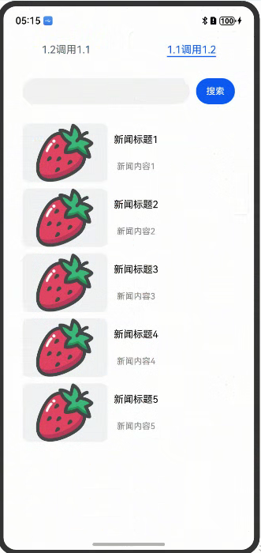

# 1.0和2.0支持支持组件相互兼容嵌套示例

## 介绍

ArkUI1.0页面使用兼容组件嵌入ArkUI2.0的子树；
ArkUI1.0页面使用兼容组件嵌入ArkUI2.0的子树；


## 效果图预览
|ArkUI1.0调用2.0|ArkUI2.0调用1.0|
|----------|--------------|
| ||

## 工程结构&模块类型

```
   ModuleSample
   |---entry
   |   |---src/main/ets/pages
   |   |   |---ArkUI1_2.ets                 // 1.2嵌套界面
   |   |   |---Index.ets                    // 1.1嵌套界面
   |---libaray1_1                           // 1.1har包
   |   |---src/main/ets/pages/components
   |   |   |---common
   |   |   |   |---constants
   |   |   |   |   |---CommonConstants.ets
   |   |   |---components
   |   |   |   |---ProductItemComp.ets
   |   |   |---model
   |   |   |   |---ProductModel.ets
   |   |   |---pages
   |   |   |   |---ProductWaterFlowPage.ets
   |---libaray1_2                           // 1.2har包
   |   |---src/main/ets/pages/components
   |   |   |---MainPage.ets
```

## 实现思路

### 场景1：1.1调用1.2界面。

* 静态库library1_2，库内实现一个ArkUI1.2代码编写的[SearchSwiperComponent](library1_2/src/main/ets/components/MainPage.ets),通过导入该静态库并调用实现了ArkUI2.0页面使用兼容组件嵌入ArkUI1.0的子树场景。

### 场景2：1.2调用1.1界面。
* 静态库library1_1，库内实现一个ArkUI1.1代码编写的[ProductWaterFlowPage](library1_1/src/main/ets/components/pages/ProductWaterFlowPage.ets),通过导入该静态库并调用实现了ArkUI1.0页面使用兼容组件嵌入ArkUI2.0的子树场景。

## 相关权限

无

## 依赖

无

## 约束与限制

1. 本示例仅支持标准系统上运行，支持设备：Phone;
2. 本示例为Stage模型，支持API20版本SDK，SDK版本号(API Version 20),镜像版本号(6.0.0.31)。
3. 本示例需要使用DevEco Studio 版本号(6.0.0.31)版本才可编译运行。

## 下载

如需单独下载本工程，执行如下命令：

```
git init
git config core.sparsecheckout true
echo code/ArkTS1.2/CompatibleNestingSample/ > .git/info/sparse-checkout
git remote add origin https://gitcode.com/openharmony/applications_app_samples.git
git pull
```