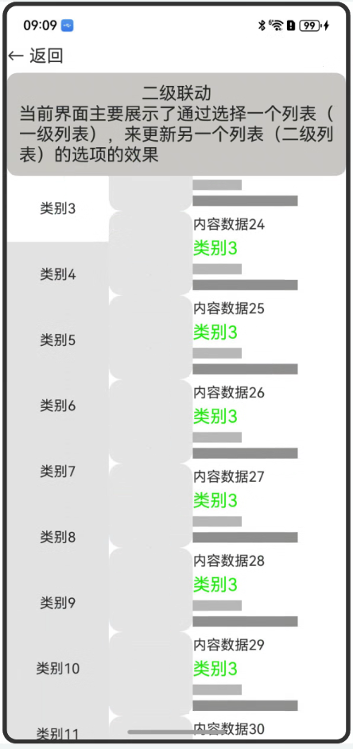
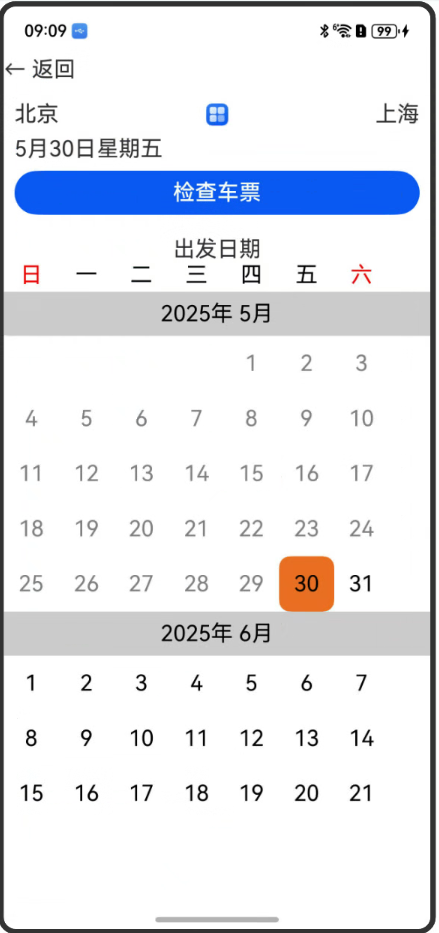
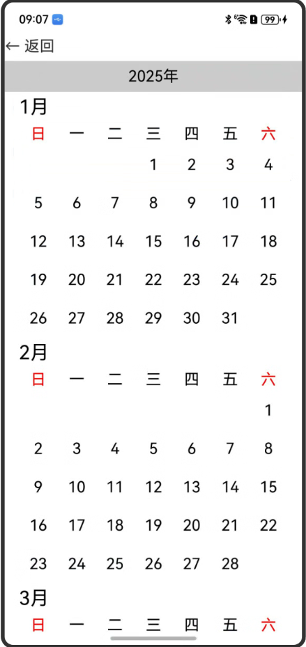

# 组件复用示例

### 介绍

1.主页实现图文混排组件复用场景；
2.实现日历场景的组件复用，属于高负载刷新的组件复用场景；

### 效果预览

效果如下所示：

|主界面|列表二级联动|自定义日历选择器|跨文件样式复用和组件复用|合理处理高负载组件的渲染文章示例代码|
|--------------------------------|--------------------------------|--------------------------------|--------------------------------|--------------------------------|
||||||

使用说明

1. 在主界面，点击蓝色按钮"列表二级联动"。
    * 滑动二级列表侧控件，一级列表随之滚动。
    * 点击一级列表，二级列表随之滚动。
2.  在主界面，点击蓝色按钮"自定义日历选择器"。
    * 点击购物车页面的list列表跳转商品详情页。
3.  在主界面，点击蓝色按钮"跨文件样式复用和组件复用"。
    * 加载完成后显示主界面，点当前日期后会显示日历选择器，选择日期后会关闭日历选择器，主页面日期会变成选定的日期。
4.  在主界面，点击蓝色按钮"合理处理高负载组件的渲染文章示例代码"。
    * 加载10年的日历数据。


### 工程目录

```
entry/src/main/ets/
|---pages
|   |---Example1
|   |   |---DataType.ets                       // 数据类型定义
|   |   |---Example1.ets                            
|   |   |---SecondaryLinkExample.ets           // 二级联动功能实现页面
|   |---Example2
|   |   |---components 
|   |   |   |---DateModel.ets                  // 数据类型定义
|   |   |   |---GetDate.ets                    // 获取日期信息
|   |   |   |---MonthDataSource.ets            // 数据类型定义
|   |   |----view
|   |   |   |---CalendarView.ets               // 场景主页面 + 自定义日历
|   |   |---Example2.ets 
|   |---Example3
|   |   |---components 
|   |   |   |---CommonText.ets                 // 自定义组件封装
|   |   |   |---LazyForEach.ets                // 懒加载
|   |   |----view
|   |   |   |---Details.ets                    // 页面：详情页
|   |   |   |---ShoppingCart.ets               // 页面：购物车
|   |   |---Example3.ets 
|   |---Example4
|   |   |---GetDate.ets                        // 获取日期信息
|   |   |---MonthDataSource.ets                // 懒加载数据类型
|   |   |---Example4.ets 
|   |   |---ReusePage.ets                      // 正常加载数据的页面
|   |---index.ets                              // 首页
```

### 具体实现

* Example1(列表二级联动) 源码参考: [Example1](entry/src/main/ets/pages/Example1)
    * 构造懒加载数据源类型[MyDataSource](entry/src/main/ets/pages/Example1/DataType.ets)
    * 一二级列表分别绑定不同的Scroller对象，一级列表(tagLists)绑定classifyScroller对象，二级列表绑定scroller对象。
    * 通过循环，构造一二级列表数据。
    * 点击一级列表后，通过一级列表的索引获取二级列表的索引，调用scrollToIndex方法将一二级列表滚动到指定索引值。
    * 通过二级列表索引获取一级列表索引，调用scrollToIndex方法将一级列表滚动到指定索引值。
* Example2(自定义日历选择器) 源码参考: [Example2](entry/src/main/ets/pages/Example2)
    * 获取当前月和下个月的日期信息。源码参考[GetDate.ets](entry/src/main/ets/pages/Example2/components/GetDate.ets)
    * 通过Flex类初始化自定义日历界面。源码参考[CalendarView.ets](entry/src/main/ets/pages/Example2/view/CalendarView.ets)。
* Example3(跨文件样式复用和组件复用) 源码参考: [Example3](entry/src/main/ets/pages/Example3)
    * 使用了自定义封装的Image+Text的图文复合组件[ImageText](entry/src/main/ets/pages/Example3/common/CommonText.ets)
* Example4(合理处理高负载组件的渲染文章示例代码) 源码参考: [Example4](entry/src/main/ets/pages/Example4)
    * 通过组件复用，加载10年的日历数据。源码参考:[ReusePage.ets](entry/src/main/ets/pages/Example4/ReusePage.ets)

### 相关权限

无

### 依赖

无

### 约束与限制

1. 本示例仅支持标准系统上运行，支持设备：Phone;
2. 本示例为Stage模型，支持API20版本SDK，SDK版本号(API Version 20),镜像版本号(5.0.1.5)。
3. 本示例需要使用DevEco Studio 版本号(6.0.0.6)版本才可编译运行。

### 下载

如需单独下载本工程，执行如下命令：

```
git init
git config core.sparsecheckout true
echo code/ArkTS1.2/ComponentSample/ > .git/info/sparse-checkout
git remote add origin https://gitee.com/openharmony/applications_app_samples.git
git pull
```