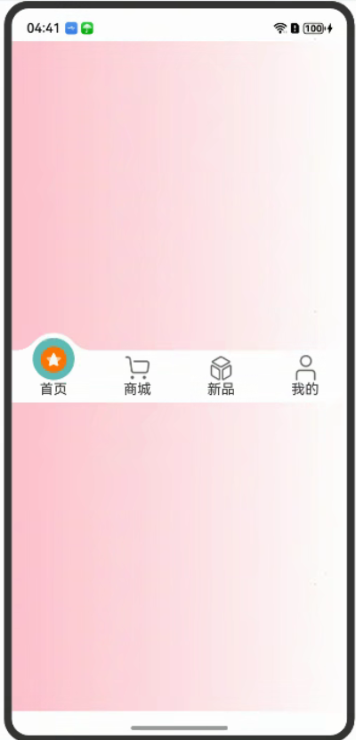

# 自定义TabBar页签凸起和凹陷案例

### 介绍

本文基于已有的模块自定义TabBar思路，完善了凸起的选择时凸起点交界处的圆滑过度和凹陷的动效

### 效果预览

效果如下所示：



使用说明

自定义TabBar页签凸起和凹陷
* 依次点击tabBar页面，凸起和凹陷的选择样式移动到指定位置并且图标移动到圆球中心。

### 工程目录

```
entry/src/main/ets/
|---components
|   |---TabsConcaveCircle
|   |   |---TabsConcaveCircle.ets              // 视图层 - 凹槽自定义TabBar页面
|   |---TabsRaisedCircle
|   |   |---TabsRaisedCircle.ets               // 视图层 - 凸起自定义TabBar页面
|   |   |---TabsRaisedCircleSelect.ets         // 视图层 - 凸起选中时圆形样式
|---types
|   |---ConcaveCircleType.ets                  // 数据结构层-凹槽所需要的数据结构
|   |---RaisedCircleTypes.ets                  // 数据结构层-凸起所需要的数据结构
|   |---TabMenusInterface.ets                  // 数据结构层-TabBar所需要的数据结构
|---utils
|   |---Functions.ets                          // 处理层-公共方法
|   |---CircleClass.ets                        // 处理层-数据类-class
|---view
|   |---index.ets                              // 示例代码
```

### 具体实现

* 单独绘制一个圆，然后将圆向上偏移1/3。通过 radialGradient 设置选中的圆心的背景色，然后在单独绘制左右俩边的圆角过渡。 具体代码可参考，
源码参考：[TabsRaisedCircleSelect.ets](entry/src/main/ets/components/tabsRaisedCircle/TabsRaisedCircleSelect.ets)
* 通过 canvas 来绘制 TabBar 的背景和凹槽部分，然后通过 Stack 来将 球体 和 菜单层叠在一起组合成一个完整的 TabBar。 具体代码可参考，
  源码参考：[TabsConcaveCircle.ets](entry/src/main/ets/components/tabsConcaveCircle/TabsConcaveCircle.ets)

### 相关权限

无

### 依赖

无

### 约束与限制

1. 本示例仅支持标准系统上运行，支持设备：Phone;
2. 本示例为Stage模型，支持API20版本SDK，SDK版本号(API Version 20),镜像版本号(6.0.0.31)。
3. 本示例需要使用DevEco Studio 版本号(6.0.0.6)版本才可编译运行。

### 下载

如需单独下载本工程，执行如下命令：

```
git init
git config core.sparsecheckout true
echo code/ArkTS1.2/CustomDrawTabBar/ > .git/info/sparse-checkout
git remote add origin https://gitcode.com/openharmony/applications_app_samples.git
git pull
```