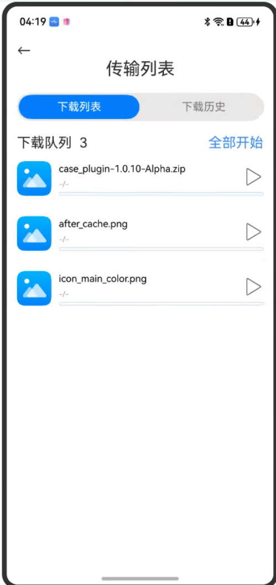

# 文件并行化处理场景

### 介绍

多文件下载监听案例

### 效果预览

效果如下所示：

|多文件下载监听案例|
|--------------------------------|
||

使用说明

在多文件下载监听案例。
    * 点击全部开始进行下载，下载超过3分钟进行并行化下载


### 工程目录

```
entry/src/main/ets/
|---pages
|   |   |---model 
|   |   |   |---dataType.ets                   // 数据类型定义
|   |   |---view 
|   |   |   |---HistoryItem.ets                // 下载历史组件
|   |   |   |---MultipleFilesDownload.ets      // 下载列表组件
|   |---index.ets                              // 首页
```

### 具体实现

* 多文件下载监听案例源码参考:
    * 下载历史组件。源码参考[HistoryItem.ets](entry/src/main/ets/pages/view/HistoryItem.ets)
    * 下载列表组件。源码参考[MultipleFilesDownload.ets](entry/src/main/ets/pages/view/MultipleFilesDownload.ets)

### 相关权限

网络权限: ohos.permission.INTERNET

### 依赖

无

### 约束与限制

1. 本示例仅支持标准系统上运行，支持设备：Phone;
2. 本示例为Stage模型，支持API20版本SDK，SDK版本号(API Version 20),镜像版本号(6.0.0.31)。
3. 本示例需要使用DevEco Studio 版本号(6.0.0.6)版本才可编译运行。

### 下载

如需单独下载本工程，执行如下命令：

```
git init
git config core.sparsecheckout true
echo code/ArkTS1.2/DownloadSample/ > .git/info/sparse-checkout
git remote add origin https://gitee.com/openharmony/applications_app_samples.git
git pull
```