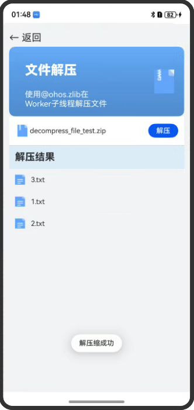

# 多文件下载，下载后对文件进行剪裁/压缩

### 介绍
示例一展示如何使用buffer来将大文件的rawfile复制到应用沙箱；

示例二在EAWorker子线程使用@ohos.zlib模块提供的zlib.compressFile接口对沙箱目录中的文件进行压缩操作，压缩成功后，弹窗提示压缩成功；

示例三在EAWorker子线程使用@ohos.zlib模块提供的zlib.decompressfile接口对沙箱目录中的压缩文件进行解压操作，解压成功后，弹窗提示解压成功；

### 效果图预览
| 主界面                                                 |  大文件复制预览 | 文件压缩   |  文件解压缩  |                                                                   
|-------------------------------------------------------|----------------------------------------------------------------------------------------------------------------------------|-------------------------------------------------------------------------|----------------------------------------------------------------------------
|  |   |  |   |  |

**使用说明**
1. 在主界面，点击蓝色按钮"大文件复制"
    * 点击Start Copy按钮开始复制
	* 当复制进度达到100%之后，点击Preview按钮进行文件的预览，以验证文件复制的正确性
	* 如果要反复验证本场景，请在复制完成之后，点击Reset按钮，重置进度，再进行后续验证
2.  在主界面，点击蓝色按钮"文件压缩"
    * 点击压缩按钮，压缩待压缩文件，提示压缩成功
3.  在主界面，点击蓝色按钮"文件解压缩"
    * 点击解压缩按钮，解压缩压缩包，提示解压成功


### 工程结构&模块类型

   ```
   entry/src/main/ets/
|---pages
|   |---Example1
|   |   |---DecompressFileViewComponent.ets           // 视图层-文件解压缩页面
|   |   |---Example1.ets 
|   |---Example2
|   |   |---BigFileCopyConstants                      // 常量                            
|   |   |---BigFileCopyView.ets                       // 视图层-文件复制页面
|   |   |---Example2.ets
|   |---Example3
|   |   |---CompressFile.ets                          // 视图层-文件压缩页面
|   |   |---CompressFileComponent.ets                 // 压缩组件
|   |   |---Example3.ets 
|   |---index.ets                                     // 首页
   ```

### 具体实现

* Example1(大文件拷贝案例) 源码参考: [Example1](entry/src/main/ets/pages/BigFileCopy)
    *  根据rawfile文件名获取其所属hap包的RawFileDescriptor，其内部包含真正rawfile文件的长度、在hap包中的偏移量，hap包的fd。
	*  打开即将写入的目标文件
	*  创建buffer，用于读写文件内容
	*  使用buffer进行文件内容的循环读写，只要实际读入buffer的内容长度不为0，就表示文件内容没有读取完毕，就将读到的内容写入目标文件。注意，这里使用了buffSize来控制想要读取内容的长度，因此需要注意在循环体内对其进行更新
	*  因为复制的是图片文件，复制完毕之后使用Image组件加载该图片进行显示，以验证复制过程的正确性
* Example2(文件压缩案例) 源码参考: [Example2](entry/src/main/ets/pages/CompressFile)
    * 使用fs.access判断输出目录是否已经存在，如果不存在使用fs.mkdirSync()创建空目录用于放置压缩后的文件。
    * 空目录创建成功后使用zlib.compressFile接口压缩文件
    * 弹窗提示压缩成功
* Example3(文件解压缩案例) 源码参考: [Example3](entry/src/main/ets/pages/DecompressFile)
    * 将项目目录rawfile下的压缩文件写入到应用的沙箱目录
    * 对沙箱目录下的压缩包进行解压
    * 弹窗提示解压成功


### 相关权限

无

### 依赖

无

### 约束与限制

1. 本示例仅支持标准系统上运行，支持设备：Phone;
2. 本示例为Stage模型，支持API20版本SDK，SDK版本号(API Version 20),镜像版本号(6.0.0.31)。
3. 本示例需要使用DevEco Studio 版本号(6.0.0.21)版本才可编译运行。

### 下载

如需单独下载本工程，执行如下命令：

```
git init
git config core.sparsecheckout true
echo code/ArkTS1.2/FilesSample/ > .git/info/sparse-checkout
git remote add origin https://gitcode.com/openharmony/applications_app_samples.git
git pull
```