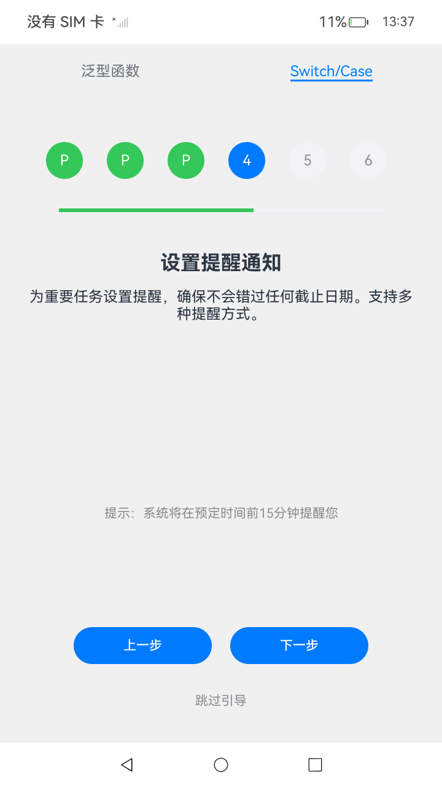

# 语法能力增强示例

## 介绍

支持UI中使用Switch/Case语法；
支持函数泛型；


## 效果图预览
| 支持UI中使用Switch/Case语法                                           | 支持函数泛型                                                         |
|----------------------------------------------------------------|----------------------------------------------------------------|
|  |  |

## 工程结构&模块类型

```
   GrammarSample
   |---entry
   |   |---src/main/ets/pages
   |   |   |---FuncGenericDemo.ets          // 函数泛型
   |   |   |---Index.ets                    // 主界面
   |   |   |---SwitchCaseDemo.ets           // Switch/Case语法

```

## 实现思路

### 场景1：支持UI中使用Switch/Case语法。

* 使用[switch/case](entry/src/main/ets/pages/SwitchCaseDemo.ets)结构根据当前步骤显示不同内容
  * 每个步骤包含标题和详细描述
    部分步骤下方显示额外的提示信息 
* 界面组件设计
  * 步骤指示器
    使用圆形标识表示每个步骤
    三种状态样式：
    当前步骤：蓝色背景，显示步骤数字
    已完成步骤：绿色背景，显示Pass图标，可点击返回
    未完成步骤：灰色背景，显示步骤数字，可点击跳转
  * 进度条
    水平条形进度指示器
    绿色表示已完成部分，灰色表示未完成部分
    动态计算宽度百分比反映进度
  * 导航控制
    "上一步"按钮：返回前一步骤（第一步不显示）
    "下一步"按钮：前进到下一步骤（最后一步变为"开始使用"）
    "跳过引导"链接：直接跳转到最后一步
### 场景2：支持函数泛型。
* 创建了泛型构建函数[forEachWithType](entry/src/main/ets/pages/FuncGenericDemo.ets)，可复用渲染不同类型的数据列表
* 界面组件设计
  * 商品列表
    展示商品名称、价格和分类信息
    提供"加入购物车"按钮，点击后商品会被添加到购物车
  * 用户列表 展示用户姓名和邮箱信息;采用简洁的卡片式设计；
  * 购物车 显示已添加的商品、单价、数量和总价；自动计算购物车总金额；提供结算功能；空购物车状态提示

## 相关权限

无

## 依赖

无

## 约束与限制

1. 本示例仅支持标准系统上运行，支持设备：Phone;
2. 本示例为Stage模型，支持API20版本SDK，SDK版本号(API Version 20)。
3. 本示例需要使用DevEco Studio 版本号(6.0.0.43)版本才可编译运行。

## 下载

如需单独下载本工程，执行如下命令：

```
git init
git config core.sparsecheckout true
echo code/ArkTS1.2/GrammarSample/ > .git/info/sparse-checkout
git remote add origin https://gitcode.com/openharmony/applications_app_samples.git
git pull
```