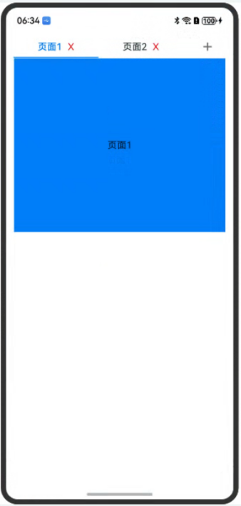

# Tab组件实现增删Tab标签

### 介绍

本示例介绍使用了Tab组件实现自定义增删Tab页签的功能。

### 效果预览

效果如下所示：



使用说明

Tab组件实现增删Tab标签
* 点击新增按钮，新增Tab页面。
* 点击删除按钮，删除Tab页面。

### 工程目录

```
entry/src/main/ets/
|---pages
|   |---Index.ets
```

### 具体实现

* Tab组件实现增删Tab标签案例，源码参考：[Index.ets](entry/src/main/ets/pages/Index.ets)
* 添加按钮添加TabBar的页面，自定义TabBar加入删除按钮实现TabBar的删除。

### 相关权限

无

### 依赖

无

### 约束与限制

1. 本示例仅支持标准系统上运行，支持设备：Phone;
2. 本示例为Stage模型，支持API20版本SDK，SDK版本号(API Version 20),镜像版本号(6.0.0.31)。
3. 本示例需要使用DevEco Studio 版本号(6.0.0.6)版本才可编译运行。

### 下载

如需单独下载本工程，执行如下命令：

```
git init
git config core.sparsecheckout true
echo code/ArkTS1.2/HandletabsSample/ > .git/info/sparse-checkout
git remote add origin https://gitcode.com/openharmony/applications_app_samples.git
git pull
```